# 第二章。对科学工作流和科学计算配方成分的更深入研究

**科学工作流** 是用来描述解决科学计算问题所需的一系列结构化活动和计算步骤的术语。科学计算中涉及的计算非常密集，非常复杂，并且具有复杂的依赖性。在本章的剩余部分，我们将继续使用科学计算问题词来表示科学工作流。让我们讨论大多数科学计算问题所需的各种数学和计算组件。

在本章中，我们将涵盖以下主题:

*   科学计算的数学部分
*   Python 的科学计算库
*   NumPy 简介
*   SciPy 简介
*   利用熊猫进行数据分析
*   **交互 Python** ( **IPython** )进行交互编程
*   使用 SymPy 的符号计算
*   利用 Matplotlib 实现数据可视化

# 科学计算的数学成分

首先，我们将简要讨论科学计算问题中可能出现的各种数学成分。我们还将寻找解决问题的可能方法。然而，在这次讨论中，我们将不研究任何方法的细节。在后面的部分，我们将讨论与这些概念相关的 Python APIs。

## 线性方程组

在科学计算和应用数学的大多数应用中，最常见的数学成分是线性代数方程组。通常，该系统可能由于线性方程的非线性方程或代数方程的微分方程的近似而出现。

线性方程组是包含一组变量的联立线性方程组的集合，例如:

```py
2 x1  +  1 x2  + 1 x3  =  1
1 x1   -  2 x2  - 1 x3  =  2
1 x1  +  1 x2  + 2 x3  =  2
```

这是一个包含三个未知变量的线性方程组:`x1`、`x2`和`x3`。这个系统的一个解决方案是给这些未知变量赋值，使得这些值同时满足所有三个方程。这些方程的解如下所示:

```py
x1  =  (1/2)
x2  =  (-3/2)
x3  =  (3/2)
```

这个解满足所有三个方程。这就是为什么我们称这些线性方程为线性方程组——这些方程被认为是一个系统，而不是单个的方程。通常，迭代方法是需要重复步骤来计算解的方法。在编程中，这种重复使用任何可用的循环来执行。另一方面，非迭代方法使用计算公式来寻找解。求解线性方程组的方法有很多种。有迭代和非迭代方法。例如，高斯 LU 分解法和消元法是非迭代方法的两个例子。雅可比迭代法和高斯-塞德尔迭代法是两种常用的迭代法。

## 非线性方程组

方程的非线性系统是一组联立方程，其中未知变量表现为次数大于 1 的多项式。该系统可以是一维的或多维的。一般来说，线性方程的形式如下。对于给定的函数`f`，我们需要找到这个条件成立的值`x`:

```py
*f(x) = 0*

```

`x`的这个值叫做方程的**根** 或零。

求解线性方程时有两种不同的情况，如下所示。在第一种情况下，有一个单变量的非线性方程:

```py
*f: RàR (scalar)*

```

这个方程的解是一个标量`x`，对于这个标量`f(x) = 0`。第二种情况是具有未知变量的`n`非线性方程组:

```py
*f: Rn à Rn (vector)*

```

这类方程的解是一个向量`x`，对于所有`f(x) = 0`，函数 f 的所有分量同时为零。

例如，一维非线性方程如下:

```py
*3x + sin(x) -ex = 0*

```

其近似解到两位小数为`0.36`。这里给出了一个二维非线性方程组的例子:

```py
*3-x2=y*
*x+1=y*

```

前一系统的解向量为`[1, 2]`和`[-2, -1]`。

有许多方法可以求解非线性方程和非线性方程组。对于一维方程，方法如下:

*   等分法
*   牛顿法
*   割线法
*   插值法
*   逆插值法
*   逆二次插值
*   线性分数插值

类似地，对于一个非线性方程组，我们也有许多方法，如下所示:

*   牛顿法
*   割线更新法
*   阻尼牛顿法
*   布赖登方法

由于这些方法是迭代方法，它们的收敛速度是一个需要观察的重要性质。所谓收敛，我们指的是这些方法从近似解开始，并朝着获得精确解的方向前进。向解收敛的速度称为收敛速度。更快的收敛方法更有利于获得精确的解，因为它将花费更少的时间。对于一些较快的方法，如牛顿法，选择初始近似是重要的一步。如果某些方法的初始近似与解不够接近，则总有可能无法收敛到解。有一些混合方法作为性能和保证解决方案之间的折衷；阻尼牛顿法就是这种方法的一个例子。 SciPy 包实现了许多求解非线性方程组的方法。您可以参考[http://docs . scipy . org/doc/scipy-0 . 14 . 0/reference/generated/scipy . optimize . Newton . html](http://docs.scipy.org/doc/scipy-0.14.0/reference/generated/scipy.optimize.newton.html)获取更多关于牛顿-拉夫森方法及其实现的信息。

## 优化

优化是试图获得最佳可能解的过程。通常，它将是所有解中具有最大值或最小值的解。例如，如果我们需要知道组织正在进行的任何项目的成本，那么给出最小成本的选项将是优化选项。同样，如果比较的是各种销售策略，那么产生最大利润的策略将是优化的选择。SciPy 有一个优化技术包。您可以参考[http://docs.scipy.org/doc/scipy/reference/optimize.html](http://docs.scipy.org/doc/scipy/reference/optimize.html)了解更多详情和这些方法的实施。优化在各种科学和工程领域都有应用。其中一些如下:

*   力学和工程学
*   经济学
*   运筹学
*   控制工程
*   石油钻采工程
*   分子建模

## 插值

在科学和工程领域，用户有许多从采样或一些实验中获得的数据点。这些数据点代表自变量特定值的函数值。现在，通常需要为范围内的剩余点估计这个函数的值。这个估计过程叫做插值。这可以通过曲线拟合或回归分析来实现。

例如，考虑独立变量`x`的以下值和函数`f`的相应值:

```py
x  4  5   6  7  8  9  10
f(x)  48   75  108  147  192  243  300
```

使用插值方法，我们可以为变量的其他值估计这个函数的值，如`x=7.5`，即`f(7.5)`或`f(5.25)`。虽然前面例子中给出的函数非常简单(`f(x) = 3x2`)，但是它可以是现实例子中的任何函数。例如，该函数可以是电子商务组织的互联网数据中心的服务器机房的温度读数。这些温度读数可以在不同的时间点获取。温度读数的时间可以是两次读数之间的固定时间间隔，也可以是完全随机的。在本例中，函数是独立可变时间离散值的服务器机房温度。我们需要估算或内插一天剩余时间的温度。

另一个的例子可以如下:该函数是被研究用户基于年龄在使用脸书或 WhatsApp 上投入/浪费的平均每天小时数。根据这些数据，我们可以估计除了数据点中的年龄之外的某个年龄的用户使用脸书或 WhatsApp 的小时数。

## 外推

另一个密切相关的问题是外推。顾名思义，它是内插在自变量取值范围之外的延伸。例如，如果我们得到了 12 岁至 65 岁用户年龄值的脸书/WhatsApp 使用小时数的值，那么估计 12 岁以下和 65 岁以上用户花费小时数的问题就属于外推范围。这是因为它超出了自变量给定数据点的范围。

我们有许多方法可以用于插值和外推。以下是一些插值方法的名称:

*   分段常数插值
*   线性内插法
*   多项式插值
*   样条插值
*   高斯过程插值

以下是一些外推方法:

*   线性外推
*   多项式外推
*   圆锥外推
*   法国曲线外推

## 数值积分

数值积分是使用任何数值技术逼近积分值的过程。积分的数值计算也称为求积。我们需要近似数值积分，因为有些函数不能解析积分。即使有公式存在，它也可能不是计算积分最有效的方法。在某些情况下，我们应该对一个未知函数进行积分，而这个未知函数只有一些样本是已知的。利用数值积分，我们逼近定积分的值。这也是基于通过指定的一组点的多项式拟合，然后积分逼近函数。在 Python 中，SciPy 包有一个用于集成的模块。集成模块及其实现详见[http://docs.scipy.org/doc/scipy/reference/integrate.html](http://docs.scipy.org/doc/scipy/reference/integrate.html)。有许多方法可以求解数值积分，如下所示:

*   辛普森公式
*   梯形法则
*   精细梯形法则
*   高斯求积法则
*   牛顿-柯特斯求积法则
*   高斯-勒让德积分

## 数值微分

数值微分是利用函数的已知值来估计函数的导数的过程。它在几种情况下非常有用。一般来说，在某些情况下，我们不太清楚底层函数是否存在，我们只有一个离散的数据集。在这种情况下，用户有兴趣研究与衍生品相关的数据变化。有时，为了性能和简单起见，我们更喜欢近似导数，而不是计算其精确值，因为精确公式是可用的，但求解起来非常复杂。微分经常被用来解决优化问题。机器学习技术大部分时间也依赖于数值微分。

数值微分的方法如下:

*   差分逼近
*   微分求积
*   有限差分系数
*   插值微分

## 微分方程

一个微分方程是一个数学方程，可以将一个函数与其导数联系起来。函数代表一个物理量，导数对应这个量的变化率，方程是两者的关系。例如，自由下落物体在重力作用下的运动通常用一组微分方程来表示。微分方程在很多领域都有应用，包括纯数学和应用数学、物理、工程和其他学科。这些科目主要涉及各种类型的微分方程。

微分方程主要用于模拟每一个物理、技术和生物过程。在许多情况下，微分方程可能无法直接求解。因此，应使用数值方法近似求解。大多数物理基本定律(例如牛顿第二定律和爱因斯坦场方程)和化学基本定律，如速率定律或速率方程，都被表述为微分方程。微分方程已经被用来在生物学(例如，生物种群增长)和经济学(例如，简单的指数增长模型)中模拟复杂系统的行为。

微分方程可以分为两种类型:**常微分方程** ( **ODE** ) 和 **偏微分方程** ( **PDE** )。ODE 是包含一个独立变量的函数及其导数的方程。另一方面，偏微分方程包含多个独立变量的函数及其偏导数。多变量函数的偏导数是这个函数相对于其中一个变量的导数。这些方法在 SciPy 中的概念细节和实现可以参考[http://docs . SciPy . org/doc/SciPy-0 . 13 . 0/reference/generated/SciPy . integrate . ode . html](http://docs.scipy.org/doc/scipy-0.13.0/reference/generated/scipy.integrate.ode.html)。

求解微分方程的各种方法如下:

*   欧拉方法
*   泰勒级数法
*   龙格-库塔法
*   龙格-库塔四阶公式
*   预测校正法

以下是用于求解偏微分方程的一些方法:

*   有限元法
*   差分法
*   有限体积法

### 初值问题

初值问题是一个普通的微分方程，以及解域中某一点的未知函数值，例如， *dy/dx = f(x，y)* ，其中， *y=y1* 代表 *x=x1* 。

### 边值问题

边值问题也是一个带有一些约束的微分方程，它的解是满足这些给定约束的微分方程的解。这些约束称为边界条件。

## 随机数发生器

在计算中，随机数生成器是一种算法或过程，它生成一个不遵循任何模式的数字序列，这就是为什么它们被称为随机数。几乎不可能预测将要生成的数字。使用随机数的应用程序的数量日益增加，因此导致了许多随机数生成方法的发展。这个概念已经被使用了很长时间，例如使用骰子，硬币翻转，使用扑克牌，以及更多的方法。然而，这些方法对于随机数的值是有限的。

随机数生成的计算方法很快在各种各样的应用中变得流行起来，例如统计抽样、赌博、随机设计生成设计、各种科学和工程概念的计算机模拟，以及许多需要不可预测结果的其他领域，例如密码学。

随机数发生器主要有两大类，即真随机数发生器和伪随机数发生器。真正的随机数生成器使用一些物理现象来生成随机数，例如，硬盘实际的读取或写入时间，而伪随机数生成器使用计算算法来生成随机数。还有第三类随机数发生器。它们基于统计分布，如毒分布、指数分布、正态分布、高斯分布等。

各种伪随机数发生器如下:

*   布卢姆舒卜
*   威奇曼山
*   互补进位乘法
*   逆同余发生器
*   密码
*   滞后斐波那契发生器
*   线性同余发生器
*   线性反馈移位寄存器
*   最大周期倒数
*   梅森龙卷风
*   进位乘法
*   Naor-Reingold 伪随机函数
*   帕克-米勒随机数发生器
*   均匀分布长周期线性

# Python 科学计算

Python 对科学计算的支持是由许多用于科学计算所需的不同功能的包和 API 组成的。对于每个类别，我们有多个选项和一个最受欢迎的选择。以下是 Python 科学计算选项的示例:

*   **图表绘制**:目前最流行的二维图表绘制包是 matplotlib。还有其他几个绘图包，如 Visvis、Plotly、HippoDraw、Chaco、MayaVI、Biggles、Pychart 和 Bokeh。有一些包是在 matplotlib 的基础上构建的，以提供增强的功能，例如 Seaborn 和 Prettyplotlib。
*   **优化**:SciPy 栈有一个优化包。优化功能的其他选择是 OpenOpt 和 CVXOpt。
*   **高级数据分析** : Python 支持与 R 统计包集成，使用 RPy 或 RSPlus-Python 接口进行高级数据分析。有一个基于 Python 的库，用于执行名为 pandas 的数据分析活动。
*   **数据库** : PyTables 是一个管理分层数据库的包。该软件包是在 HDF5 的基础上开发的，旨在高效处理大型数据集。
*   **交互命令外壳** : IPython 是一个支持交互编程的 Python 包。
*   **符号计算** : Python 有 SymPy、PyDSTool 等支持符号计算的包。在本章的后面，我们将讨论符号计算的概念。
*   **专用扩展** : SciKits 为 SciPy、NumPy 和 Python 提供了专用的插件。以下是 Scikits 包的精选列表:
    *   `scikit-aero`:Python 中的航空工程计算
    *   `scikit-bio`:生物信息学的数据结构、算法和教育资源
    *   `scikit-commpy`:用 Python 实现数字通信算法
    *   `scikit-image`:SciPy 的图像处理例程
    *   `scikit-learn`:一套用于机器学习和数据挖掘的 Python 模块
    *   `scikit-monaco`:用于蒙特卡罗集成的 Python 模块
    *   `scikit-spectra`:以熊猫为原型的蟒蛇光谱学
    *   `scikit-tensor`:用于多线性代数和张量因子分解的 Python 模块
    *   `scikit-tracker`:细胞生物学的目标检测和跟踪
    *   `scikit-xray`:X 射线科学的数据分析工具
    *   `bvp_solver`:求解两点边值问题的 Python 包
    *   `datasmooth`:sci kits 数据平滑包
    *   `optimization`:数值优化的 Python 模块
    *   `statsmodels`:用于 SciPy 的统计计算和模型
*   **第三方或非 scikit 包/应用/工具**:有很多项目已经为特定的科学领域开发了包/工具，例如天文学、天体物理学、生物信息学、地球科学等等。以下是 Python 中针对特定科学领域的一些选定的第三方包/工具:
    *   `Astropy`:一个社区驱动的 Python 包，用于支持天文学和天体物理学计算
    *   `Astroquery`:这个包是用来访问在线天文数据的工具集合
    *   `BioPython`:这是一个用 Python 进行生物计算的工具包集合
    *   `HTSeq`:这个包支持 Python 中高通量测序数据的分析
    *   `Pygr`:这是 Python 中用于序列和比较基因组分析的工具包
    *   `TAMO`:这是一个 Python 应用程序，用于使用 DNA 序列基序分析转录调控
    *   `EarthPy`:这是 IPython 笔记本的集合，有地球科学领域的例子
    *   `Pyearthquake`:用于地震和 MODIS 分析的 Python 包
    *   `MSNoise`:这是一个使用环境地震噪声监测地震速度变化的 Python 包
    *   `AtmosphericChemistry`:该工具支持大气化学力学的探索、构建和转换
    *   `Chemlab`:这个包是一个完整的库，用来执行与化学相关的计算

## NumPy 简介

Python 编程被扩展为支持大型数组和矩阵，以及操作这些数组的数学函数库。这些数组是多维的，这个 Python 扩展叫做 NumPy。在 NumPy 的基本实现成功后，它用许多 APIs 工具进行了扩展，包括 matplotlib、pandas、SciPy 和 SymPy。让我们来看看 NumPy 的每个子工具/子 API 的简要功能。

## 科学图书馆

SciPy 是为科学家和工程师设计和开发的 Python 库，用于执行与科学计算相关的操作。它支持不同操作的功能，如优化、线性代数、微积分、插值、图像处理、快速傅立叶变换、信号处理和特殊功能。它解决常微分方程，并执行科学和工程所需的其他任务。它建立在 NumPy 数组对象之上，是 NumPy 堆栈中非常重要的组件。这就是为什么 NumPy 栈和 SciPy 栈有时被用作同一个引用。

### SciPy 子包

SciPy 的各种子包包括以下内容:

*   `constants`:这些是物理常数和换算系数
*   `cluster`:层次聚类、矢量量化、K 均值
*   `fftpack`:离散傅里叶变换算法
*   `integrate`:数值积分例程
*   `interpolate`:插值工具
*   `io`:数据输入输出
*   `lib`:外部库的 Python 包装器
*   `linalg`:线性代数例程
*   `misc`:杂项实用程序(例如，图像读写)
*   `ndimage`:多维图像处理的各种功能
*   `optimize`:优化算法，包括线性规划
*   `signal`:信号处理工具
*   `sparse`:稀疏矩阵及相关算法
*   `spatial`:KD-树、最近邻和距离函数
*   `special`:特殊功能
*   `stats`:统计功能
*   `weave`:将 C/C++代码写成 Python 多行字符串的工具

## 利用大熊猫进行数据分析

熊猫库是一个开源库，旨在用 Python 提供高性能的数据操作和分析功能。使用 pandas，用户可以在 Python 中处理完整的数据分析工作流。此外，使用 pandas、IPython 工具包和其他库，用于执行数据分析的 Python 环境在性能和生产率方面变得非常好。熊猫图书馆只有一个缺点；它只支持线性回归和面板回归。但是对于其他功能，我们可以使用`statsmodels`和`scikit-learn`。pandas 库支持数据集的高效合并和连接。它有一系列工具，用于在不同类型的数据源之间读写数据，包括内存、CSV、文本文件、微软 Excel、SQL 数据库和 HDF5 格式。

# 使用 IPython 进行交互编程的简单想法

Python 在 IPython 的帮助下支持多种编程语言的交互计算。IPython 是一个专门为 Python 编程设计的命令外壳，现在它支持多种语言。它提供了出色的自省功能、新的 shell 语法、命令行文本完成和命令历史。内省是对命令行环境进行编程以检查各种特性(属性、方法和其他细节，如超类)的能力。IPython 具有许多特性，包括:

*   基于命令行和基于 QT 的交互式外壳
*   基于浏览器的笔记本，支持编码、数学表达式、内嵌图形和图形
*   它还能够支持交互式数据可视化和其他图形用户界面
*   支持高性能并行计算

## IPython 并行计算

IPython 对并行和分布式计算有很好的支持，便于大规模计算。它具有开发、执行、调试和监控并行或分布式应用程序的能力。IPython 支持大多数并行风格，包括以下风格，以及由此产生的任何混合方法:

*   **单程序多数据** ( **SPMD** )并行度
*   **多程序多数据** ( **MIMD** )并行度
*   **消息传递界面** ( **MPI** )
*   任务和数据并行性
*   自定义用户定义的方法

## IPython 笔记本电脑

IPython 笔记本是一个基于网络的交互式计算环境。该环境用于创建 IPython 笔记本。它接受单用户输入或单个表达式，对它们求值，并将结果返回给用户。该功能称为**读取、评估、打印和循环** ( **REPL** )。对于 REPL，用户可以使用以下 Python 库:

*   伊普提洪伊普提翁伊普提翁伊普提翁伊普提翁伊普提翁伊普提翁伊普提翁伊普提翁伊普提翁伊普提翁伊普提翁
*   MQ (ZMQ)
*   龙卷风(网络服务器)
*   jQuery
*   引导(前端框架)
*   MathJax，你好吗

笔记本程序在计算机上创建一个本地网络服务器，以便从网络浏览器访问它。IPython 笔记本是一个 JSON 文档，用于使用编码、文本、数学运算、图形和绘图来执行不同类型的计算。这些笔记本可以使用基于网络和基于命令的选项导出为各种格式。支持的格式有 HTML、LaTeX、PDF、Python 等等。

Python 笔记本的开发过程如下图所示。它从左边开始，准备数据，然后开发程序及其版本。程序开发完成后，可以导出各种格式。

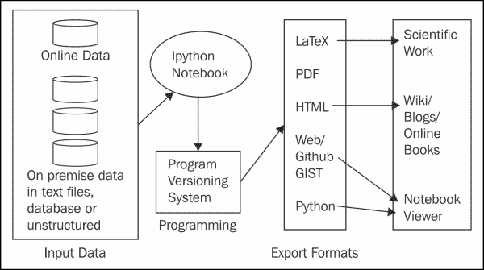

IPython 的其他一些显著特点如下:

*   与 GUI 库和工具包的非阻塞交互:IPython 支持与许多基于 Python 的 GUI 工具包/库的非阻塞交互，包括 Tkinter、PyGTK、PyQt 和 wxPython
*   集群管理:IPython 支持使用 MPI/异步状态回调消息计算集群管理工具
*   类似 Unix 的环境:IPython 的默认行为几乎类似于支持环境定制的 Unix 外壳的行为

### 型式

**下载示例代码**

您可以从您在[http://www.packtpub.com](http://www.packtpub.com)的账户下载您购买的所有 Packt Publishing 书籍的示例代码文件。如果您在其他地方购买了这本书，您可以访问[http://www.packtpub.com/support](http://www.packtpub.com/support)并注册，以便将文件直接通过电子邮件发送给您。

IPython 用户界面截图如下(来源为[http://ipython.org/notebook.html](http://ipython.org/notebook.html)):

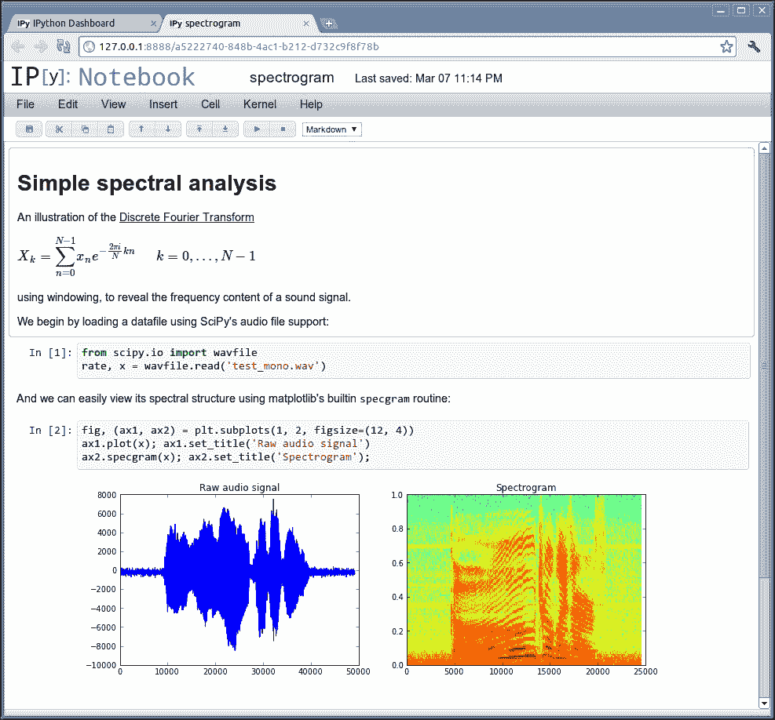

IPython 笔记本界面的用户界面

以下是 IPython 命令外壳的各种功能特性:

*   **选项卡完成**:用户无需键入完整的命令。只输入前几个字符后，按下*标签*即可完成剩余的命令。
*   **探索你的物体**:物体的各种属性可以使用内省工具来确定。
*   **魔法功能**:用户可以调用的魔法功能有很多。
*   **运行和编辑**:用户可以从命令外壳执行和编辑 Python 脚本。
*   **调试**:命令外壳中还捆绑了强大的调试工具。
*   **历史记录**:命令外壳存储命令的历史记录及其结果。
*   **系统外壳命令**:用户也可以使用系统外壳提供的命令。
*   **定义自己的系统别名**:用户可以根据自己的喜好定义命令的别名。
*   **配置**:可以使用配置文件自定义 IPython 环境。
*   **启动文件**:用户可以自定义环境，在 IPython 会话开始时运行一些命令或代码。

# 使用 SymPy 的符号计算

符号计算操纵数学对象和表达式。这些数学对象和表达式是按原样表示的，它们没有被评估/近似。带有未赋值变量的表达式/对象保留其符号形式。

让我们在下图中看看计算机化正规计算和计算机化符号计算的区别。这两种情况我们都有两个例子。**例 A1** 和**例 A2** 是正规计算的例子，**例 B1** 和**例 B2** 是符号计算的例子。**例 A1****例 A2** 输出明显。我们来看看**示例 B1** 和**示例 B2** 的输出。**示例 B1** 的输出与`sqrt(3)`相同。不执行评估；只是原始符号。这是因为在符号计算中，如果`sqrt`函数的参数不是一个完美的正方形，那么它将保持原样。另一方面，在**示例 B2** 中，输出稍微简单一些。原因是对于这个例子，有可能简化答案；`sqrt(27)`可以写成`sqrt (9 X 3)`或者`3(sqrt(3)`，所以简化为`3sqrt(3)`。

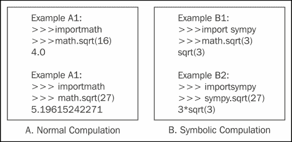

正常计算和符号计算的比较

## 症状的特征

因为它是一个符号计算库，所以 SymPy 能够象征性地执行所有类型的计算。它可以简化表达式(就像我们看到的`sqrt(8)`)；计算微分、积分和极限；并求解方程、矩阵运算和各种其他数学函数。所有这些功能都象征性地执行。

让我们讨论一下 SymPy 的各种特性。SymPy 库由核心功能和许多可选模块组成。以下是 SymPy 支持的功能:

*   核心功能，如基本运算和简化，以及模式匹配功能，如三角函数、双曲函数、指数函数、对数函数等
*   它支持多项式运算，例如，基本算术、因式分解和各种其他运算
*   微积分功能，例如，极限、微分、积分等等
*   求解各种类型的方程，例如多项式、方程组和微分方程
*   离散数学
*   矩阵表示和运算的功能
*   几何函数
*   借助外部 pyglet 模块进行绘图
*   对物理的支持
*   执行统计操作，如概率和分布
*   各种打印功能
*   编程语言和 LaTeX 的代码生成

## 为什么是症状？

SymPy 是一个开源库，并在自由的 BSD 许可下获得许可。您可以修改源代码。其他替代品则不是这样，例如 Maple 和 Mathematica。SymPy 的另一个优点是它是用 Python 设计、开发和执行的。对于 Python 开发人员来说，这带来了额外的优势。与替代工具相比，该库具有很高的可扩展性。

## 标绘库

Python 的图表绘制库被命名为 matplotlib。它提供了一个面向对象的应用编程接口，用于在使用各种 Python 图形用户界面工具包开发的应用程序中添加图表。SciPy/NumPy 使用 matplotlib 绘制数组的 2D 图。matplotlib 背后的设计理念是简化绘图功能。用户可以使用很少的函数调用或仅使用一个函数调用轻松创建各种类型的图。有一些专门的工具包/API 扩展了 matplotlib 的功能。其中一些工具与 matplotlib 捆绑在一起，另一些则可以单独下载。这里列出了其中的一些:

*   底图是一个地图绘制工具包
*   Cartopy 包用于轻松制作用于数据分析和可视化的绘图地图
*   Excel 工具支持与微软 Excel 交换数据
*   Qt 和 GTK+的接口
*   mplot3d 可用于绘制三维图

下表给出了可以使用 matplotlib 绘制的各种类型的图表。这些图表截图来自[http://matplotlib.org/users/screenshots.html](http://matplotlib.org/users/screenshots.html)的 matplotlib 网页:

<colgroup><col style="text-align: left"> <col style="text-align: left"></colgroup> 
| 

不同类型的图形:

 |   |
| --- | --- |
| 简单的情节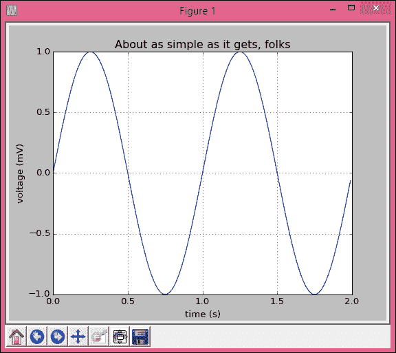 | 多轴子图演示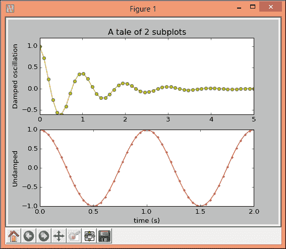 |
| 直方图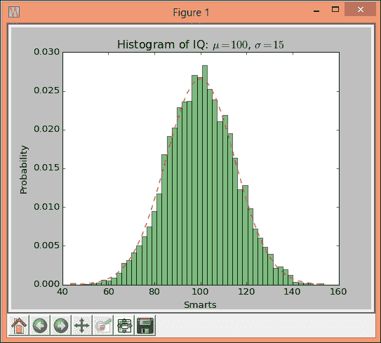 | 路径演示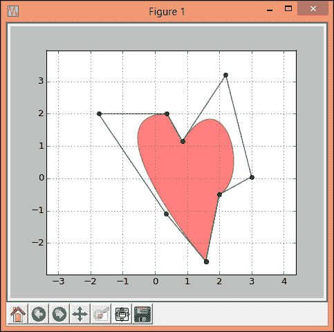 |
| mplot3d: 3D 图形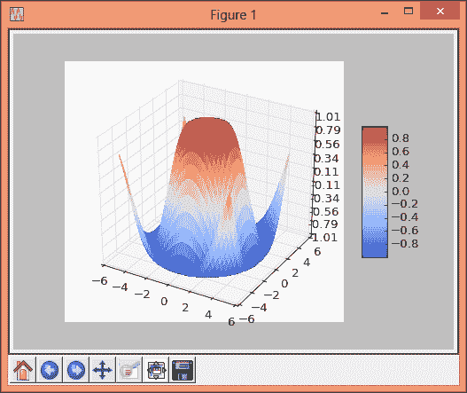 | 流图:用于绘制矢量场的流线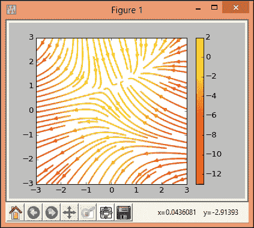 |
| 条形图图表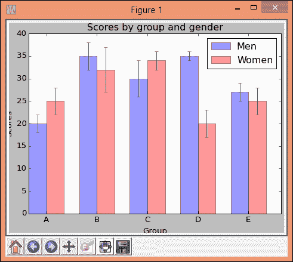 | 饼图图表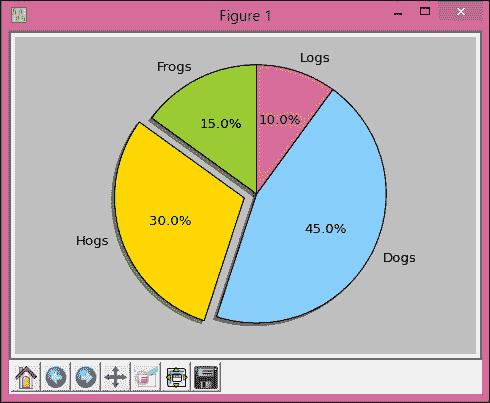 |
| 极坐标图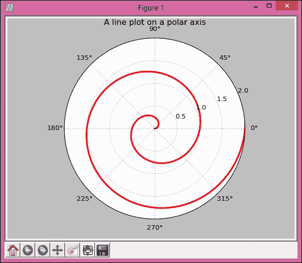 | 记录图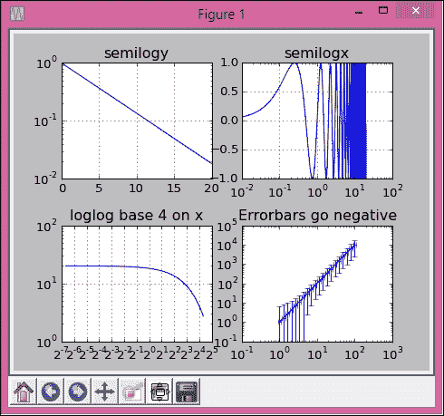 |
| 财务图表:用于通过组合 matplotlib 提供的各种绘图功能、布局命令和标记工具来绘制复杂的财务图。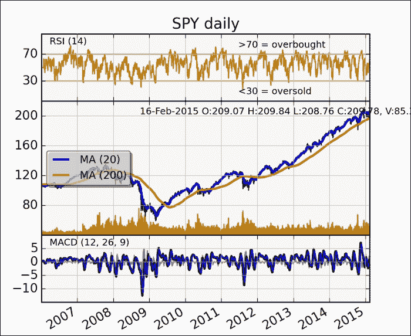 |

# 总结

在这一章中，我们讨论了数学和数值分析的许多概念，包括线性和非线性方程组、最优化、插值、外推、数值微分和积分、微分方程和随机数发生器。

在本章的第二部分，我们简要讨论了用 Python 语言执行科学计算的各种包/工具包/API。我们还讨论了 NumPy、SciPy、IPython、SymPy、matplotlib 和 pandas 的功能和特性。

在下一章中，我们将讨论如何为科学计算准备和管理数据。