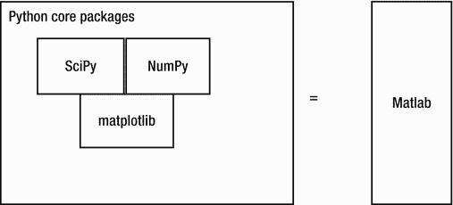

# 9.SciPy 堆栈和符号编程简介

在上一章中，我们学习了如何使用我们为 MPI4PY 和 Python 3 并行编程而构建的 Raspberry Pi 集群。在本章中，我们将介绍 SciPy 堆栈并将其安装在 Pi 上。我们还将开始使用 SymPy 进行符号编程。

## 科学 Python 堆栈

SciPy(Scientific Python 的缩写)是一个用 Python 编写的科学和技术计算的开源库。

SciPy 具有用于数值运算、常微分方程解算器、快速傅立叶变换、最优化、线性代数、积分、插值、信号处理和图像处理的模块。SciPy 被全世界的科学、数学和工程社区广泛使用。还有许多其他库使用 SciPy 和 NumPy 的核心模块进行操作。OpenCV 和 SciKit 是其他主要库使用 NumPy 和/或 SciPy 的最好例子。

SciPy 堆栈包含以下组件:

*   NumPy 是一个用于数值计算的库。它提供了数字和科学计算所需的所有基本数据类型。
*   SciPy 库有许多用于科学编程的模块。
*   Matplotlib 用于数据可视化。
*   SymPy 用于符号编程。
*   IPython 是一个高级 Python 解释器，增加了一些特性。
*   Pandas 用于数据分析。
*   Nose 用于自动化测试用例。

下图(图 [9-1](#Fig1) )总结了 Python SciPy 堆栈在科学计算世界中的作用。



图 9-1。

The components of the SciPy stack

在本书中，我们将学习 NymPy、SciPy 库、Matplotlib 和 SymPy。

## SciPy 堆栈的安装

在 Raspberry Pi 上安装 SciPy 堆栈的最佳方式是使用`apt-get`和`pip`。

首先，使用以下命令升级`pip`:

```py
sudo python3 -m pip install --upgrade pip

```

使用以下命令安装 SymPy:

```py
sudo pip3 install sympy

```

SciPy 堆栈的其余组件可以使用`apt-get`实用程序方便地安装，如下所示:

```py
sudo apt-get install python3-matplotlib -y
sudo apt-get install python3-scipy -y
sudo apt-get install python3-numpy -y

```

这将安装所需的 SciPy 堆栈组件。

## -很好

SymPy 网站上说:

> SymPy is a Python library of symbolic mathematics. Its goal is to become a fully functional computer algebra system (CAS), while keeping the code as simple as possible so as to be easy to understand and expand. SymPy is written entirely in Python.

SymPy 是 BSD 许可的，是免费的。它完全是用 Python 编写的。它依赖于`mpmath`并且本质上是轻量级的，因为没有其他依赖项。

### 入门指南

让我们从 SymPy 开始。运行以下命令创建并导航到该章节的目录:

```py
cd ∼
cd book
cd code
mkdir chapter09
cd chapter09

```

我们将把这一章的代码保存在目录`chapter09`中，并将在本书的其余部分继续这一做法，即按章创建目录来组织代码。

我假设您有一些数学和微积分的基础知识，所以我在解释代码时不必解释这些基础知识。让我们看一个符号计算概念的简单例子(列表 [9-1](#Par29) )。

```py
import math
import sympy
print(math.sqrt(9))
print(math.sqrt(8))
print(sympy.sqrt(9))
print(sympy.sqrt(8))
Listing 9-1.prog01.py

```

运行上面的代码(清单 [9-1](#Par29) )。以下是输出:

```py
3.0
2.8284271247461903
3
2*sqrt(2)

```

在上面的输出中，我们可以看到`math.sqrt()`方法直接产生数字格式的结果，而`sympy.sqrt()`方法只在结果是整数的情况下才产生数字格式的结果。它不会产生一个小数值，而是保持`sqrt(2)`不变。这样，我们就可以象征性地计算很多数学方程。有了符号数学概念的这些知识，让我们用 Python 3 更深入地研究 SymPy。

### 标志

我们来研究一下符号的概念。符号类似于数学中的变量。我们可以用它们来计算方程式和表达式。它们也可以用来解方程。`sympy.symbols()`方法将一个字符串转换成符号变量，如下所示(清单 [9-2](#Par34) ):

```py
from sympy import *

x = symbols('x')
sigma, y = symbols('sigma y')
print(x, y, sigma)

Listing 9-2.prog02.py

```

输出如下所示:

```py
x y sigma

```

上面的代码(清单 [9-2](#Par34) )展示了`symbols()`方法可以接受一个字符串作为参数，其中的标记由空格分隔。

让我们再看一个例子(清单 [9-3](#Par39) )，它演示了用符号对表达式求值。

```py
from sympy import *

x = symbols('x')
expr = x + 1
print(expr.subs(x, 3))

Listing 9-3.prog03.py

```

这将在表达式中用 3 代替`x`,并对其求值。代码(清单 [9-3](#Par39) )产生`4`作为输出。

我们可以替换多个符号如下(列表 [9-4](#Par42) ):

```py
from sympy import *

x, y = symbols('x y')
expr = x + y
print(expr.subs({x:3, y:2}))

Listing 9-4.prog04.py

```

这里，我们一次替换多个符号。运行代码并检查输出。

### 将字符串转换为 SymPy 表达式

我们可以将字符串转换成 SymPy 表达式。就像在 Python 中一样，我们可以对指数使用`**`操作符。下面的代码(清单 [9-5](#Par45) )显示了这一点:

```py
from sympy import *

str = "x**3 + 4*y - 1/5"
expr = sympify(str)
print(expr)

Listing 9-5.prog05.py

```

方法将一个字符串转换成一个 SymPy 表达式。

我们还可以使用`evalf()`方法将表达式求值为浮点数。它的默认精度是小数点后 15 位数字；但是，我们可以将精度作为参数传递。下面(列表 [9-6](#Par48) 显示了`evalf()`方法的用例示例:

```py
from sympy import *

expr = sqrt(10)
print(expr.evalf())

print(pi.evalf(20))

x = symbols('x')
expr = sin(2*x)
print(expr.evalf(subs={x: 2.4}))
The output is as follows,
3.16227766016838
3.1415926535897932385
-0.996164608835841
Printing in SymPy

Listing 9-6.prog06.py

```

### Sympy 的打印功能

SymPy 有很多打印机。在任何环境中，在命令提示符下使用`init_session()`方法都会启动一个交互式会话。下面是一个交互式会话的示例。我在控制台中输入的命令以粗体突出显示。

```py
pi@pi001:∼/book/code/chapter09 $ python3

Python 3.4.2 (default, Oct 19 2014, 13:31:11)
[GCC 4.9.1] on linux
Type "help", "copyright", "credits" or "license" for more information.
>>> from sympy import *

>>> init_session()

Python console for SymPy 1.0 (Python 3.4.2-32-bit) (ground types: python)

```

这些命令被执行:

```py
>>> from __future__ import division
>>> from sympy import *
>>> x, y, z, t = symbols('x y z t')
>>> k, m, n = symbols('k m n', integer=True)
>>> f, g, h = symbols('f g h', cls=Function)
>>> init_printing()

Documentation can be found at http://docs.sympy.org/1.0/

>>> Integral(sqrt(1/x), x)

⌠
⎮        ___
⎮      ╱ 1
⎮    ╱   ─  dx
⎮╲╱     x
⌡
>>> sqrt(x)

√x
>>> (sqrt(x) + sqrt(y))**2

         2
(√x + √y)
>>>

```

这就是我们如何在交互式控制台中以良好的格式打印表达式。

### 症状的简化

我们可以使用`simplify()`方法尽可能简化数学表达式。这下涵盖了大量的表达式。以下(清单 [9-8](#Par55) )就是一个例子:

```py
from sympy import *
x = symbols('x')
print(simplify(sin(x)**2 + cos(x)**2))
print(simplify((x**3 + x**2 - x - 1)/(x**2 + 2*x + 1)))
print(simplify(gamma(x)/gamma(x - 2)))
Listing 9-8.prog08.py

```

简化的输出如下:

```py
1
x - 1
(x - 2)*(x - 1)

```

SymPy 中有更多的简化方法。我们可以使用`expand()`来展开一个多项式表达式，如下所示(列表 [9-9](#Par59) )。

```py
from sympy import *
x, y = symbols('x y')
print(expand((x + y)**2))
print(expand((x + 3)*(y + 5)))
Listing 9-9.prog09.py

```

以下是扩展后的输出:

```py
x**2 + 2*x*y + y**2
x*y + 5*x + 3*y + 15

```

类似地，我们可以使用`factor()`方法(列表 [9-10](#Par63) )来寻找多项式的不可约因子。

```py
from sympy import *
x = symbols('x')
print(factor(x**3 - x**2 + x))
Listing 9-10.prog10.py

```

输出如下所示:

```py
x*(x**2 - x + 1)

```

### 结石

我们甚至可以用 SymPy 来做微积分。我们可以使用`diff()`方法计算导数如下(列表 [9-11](#Par67) ):

```py
from sympy import *
x = symbols('x')
print(diff(x**3 - x**2 + x, x))
print(diff(x**5, x))
print(diff(sin(x), x))
Listing 9-11.prog11.py

```

输出是:

```py
3*x**2 - 2*x + 1
5*x**4
cos(x)

```

我们还可以找到如下表达式的高阶导数(列表 [9-12](#Par71) ):

```py
from sympy import *
x = symbols('x')
print(diff(10*x**4, x, x, x))
print(diff(10*x**4, x, 3))
Listing 9-12.prog12.py

```

输出如下所示:

```py
240*x
240*x

```

我们也可以使用`integrate()`方法计算带有 SymPy 的积分。下面的代码(清单 [9-13](#Par75) )演示了这一点:

```py
from sympy import *
x = symbols('x')
print(integrate(sin(x), x))
Listing 9-13.prog13.py

```

输出如下所示:

```py
-cos(x)

```

我们还可以集成如下限制(列表 [9-14](#Par79) ):

```py
from sympy import *
x = symbols('x')
print(integrate(exp(-x), (x, 0, oo)))
Listing 9-14.prog14.py

```

这里，我们对`-x`的指数从零到无穷大进行积分(用`oo`表示)。运行这个并检查输出。我们也可以计算多重极限的多重积分如下(列表 [9-15](#Par81) ):

```py
from sympy import *
x, y = symbols('x y')
print(integrate(exp(-x)*exp(-y), (x, 0, oo), (y, 0, oo)))
Listing 9-15.prog15.py

```

运行代码(列表 [9-15](#Par81) )并通过手动执行集成来验证输出。

Note

SymPy 真是个大话题。这不可能在一章中完全涵盖。我建议读者在 [`http://docs.sympy.org`](http://docs.sympy.org) 和 [`www.sympy.org`](http://www.sympy.org) 网站上多探索。

## 结论

在这一章中，我们从 SymPy 开始，学习了如何在 Python 中执行符号计算。在下一章，我们将从 NumPy 和 Matplotlib 开始。