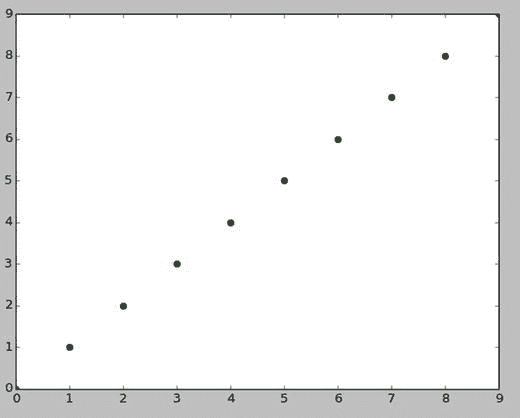
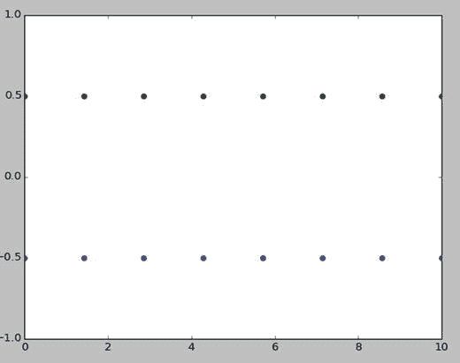
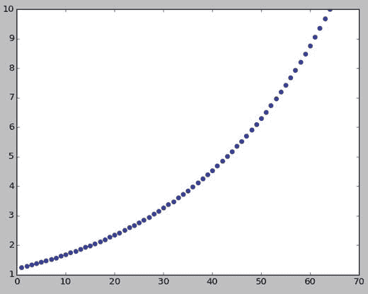
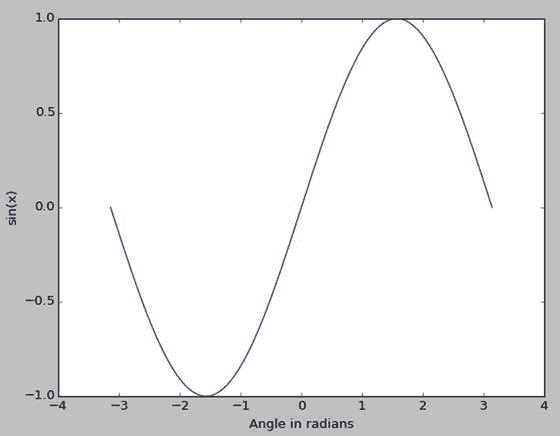
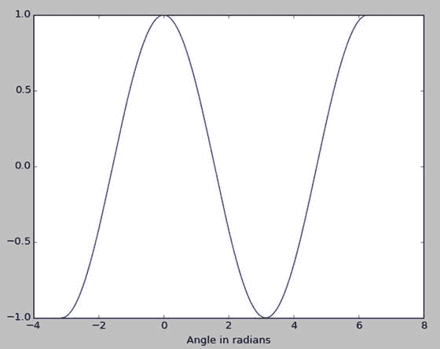
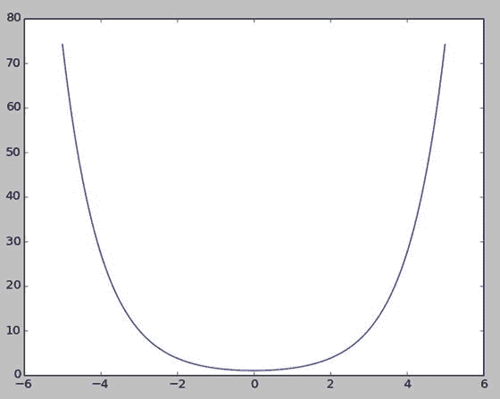
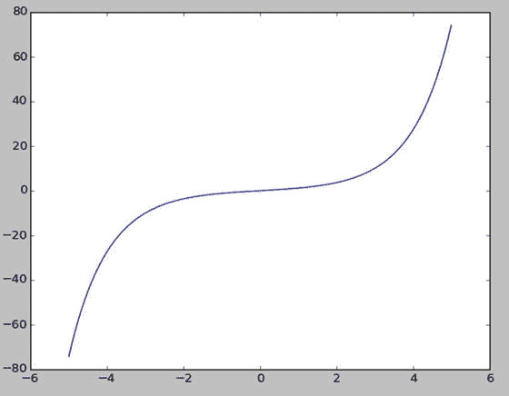
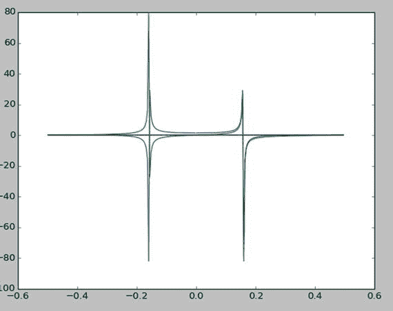

# 10.NumPy 简介

在上一章中，我们学习了如何安装 SciPy 堆栈，以及如何在 Python 3 中使用 SymPy 进行符号计算。在这一章中，我们将被介绍到 NumPy 库，我们将学习 NumPy 的基础知识。我们还将学习使用 Matplotlib 绘制和可视化数据的基础知识。因此，让我们通过学习 NumPy 的基础知识，开始进入科学计算世界的激动人心的旅程。

## NumPy 基础

NumPy 是数字(al) Python 的缩写。它的网站( [`http://www.numpy.org`](http://www.numpy.org) )上说:

> 努比切望 python(python 语言)

进行科学计算的基础包

其特点如下:

它有一个强大的自定义 N 维数组对象，可以高效方便地表示数据。

它拥有与其他用于科学编程的编程语言(如 C/C++和 FORTRAN)集成的工具。

它用于数学运算，如线性代数、矩阵运算、图像处理和信号处理。

### 朱皮特

到目前为止，我们一直将代码保存在`.py`文件中，并用 Python 3 解释器运行它。在这一章中，我们将使用一个叫做 Jupyter 的工具，这是一个基于网络的高级工具，用于在编程语言 Julia、Python 和 R .

> Ju `lia +` pyt `hon +` r `= Jupyter` t5]

它将 Python 3(或任何其他支持的语言，如 R 和 Julia)代码和结果保存在一种叫做笔记本的交互格式中。Jupyter 使用 Python 2 和 Python 3 的 IPython 内核。IPython 是 Python 的高级交互式 shell，具有可视化功能。Jupyter 项目是 IPython 的副产品。

Jupyter 和 IPython 具有以下特性:

*   基于终端和 Qt 的交互式 shells
*   基于浏览器的笔记本，支持代码和交互式可视化
*   支持并行计算

可以使用以下命令轻松安装它:

```py
sudo pip3 install --upgrade pip
sudo pip3 install jupyter

```

这将安装 Jupyter 及其对 Raspberry Pi 的所有依赖。

### jupyter 笔记型电脑

Jupyter Notebook 是由 Jupyter Notebook 应用程序生成的文档，其中包含 Python 代码和丰富的文本元素，如段落、等式、图形、链接和交互式可视化。笔记本有人类可读组件和机器可读(可执行)组件。

让我们现在就开始使用 NumPy 和 Jupyter 笔记本吧。打开 lxterminal 并运行以下命令序列:

```py
cd ∼
cd book
cd code
mkdir chapter10
cd chapter10

```

这将创建并导航到对应于当前章节`chapter10`的目录。

现在，这是我们的笔记本启动文件夹，让我们从这里使用以下命令启动笔记本:

```py
jupyter notebook

```

它将启动 Jupyter 笔记本应用程序，并打开一个浏览器窗口(在 Raspbian 的最新版本中为 Chromium 浏览器)。

下面(图 [10-1](#Fig1) )是 Jupyter 笔记本启动时的控制台截图:


图 10-1。

Jupyter Notebook App console

下面(图 [10-2](#Fig2) )是 Chromium 浏览器窗口标签运行笔记本 app 的截图:


图 10-2。

Jupyter Notebook App running in Chromium

在浏览器窗口的右上方，单击 New，然后在随后的下拉菜单中选择 Python 3。见下图(图 [10-3](#Fig3) )截图:


图 10-3。

New Python 3 notebook

它将在同一浏览器窗口中打开一个新的笔记本标签(图 [10-4](#Fig4) )。


图 10-4。

Python 3 notebook tab

将 Jupyter 笔记本的名称改为`Chapter10_Practice`，如下图截图所示(图 [10-5](#Fig5) )。


图 10-5。

Renaming the notebook

笔记本应用程序将显示一个新笔记本的实例，其名称已更新，状态为“正在运行”，如下图截图所示(图 [10-6](#Fig6) )。


图 10-6。

Notebook running

现在，如果你查看`Chapter10`目录，你会发现一个与笔记本对应的文件`Chapter10_Practice.ipynb`。

在窗口顶部的菜单栏中，有您在任何其他 IDE 中都有的选项，例如保存、复制、粘贴和运行。

在第一个单元格中键入`import numpy as np`,然后单击 Run 按钮。该控件将自动创建下一个文本单元格，并将光标置于其上，如下所示(图 [10-7](#Fig7) )。


图 10-7。

Working with Python 3 code

我们刚刚将 NumPy 导入到我们的笔记本中，因此我们不必再次导入。此外，我们也可以编辑笔记本的前一个单元格。在执行类型中，如果解释器突出了语法中的错误，我们可以通过编辑任何单元格来修复它。随着科学计算的发展，我们将对 Jupyter 有更多的了解。

### N 维数组(ndarray)

NumPy 最强大的构造是 N 维数组(`ndarray`)。`ndarray`为多维同质数据提供通用容器。同构意味着`ndarray`中的数据项是相同的数据类型。让我们看一个 Python 中各种`ndarray`类型变量的例子。在笔记本中键入以下代码:

```py
x = np.array([1, 2, 3], np.int16)
y = np.array([[0, 1, 2], [3, 4, 5]], np.int32)
z = np.array([[[0, 1, 2], [2, 3, 4], [4, 5, 6]],[[1, 1, 1], [0, 0, 0], [1, 1, 1]]], np.float16)

```

恭喜，我们刚刚创建了一维、二维和三维的`ndarray`对象。我们可以通过在 Jupyter notebook 中运行以下代码来验证这一点:

```py
print(x.shape)
print(y.shape)
print(z.shape)

```

输出是:

```py
(3,)
(2, 3)
(3, 3, 3)

```

NumPy 中的`ndarray`的索引方案与 C 语言中的相同，即第一个元素从 0 开始索引。下面一行打印了一个`ndarray`中第二行第三列的元素值。

我们可以按如下方式对数组进行切片:

```py
print(z[:,1])

```

以下是输出:

```py
[[ 2\.  3\.  4.]
 [ 0\.  0\.  0.]]

```

### n 数组属性

以下是对`ndarray`重要属性的演示:

```py
print(z.shape)
print(z.ndim)
print(z.size)
print(z.itemsize)
print(z.nbytes)
print(z.dtype)

```

以下是输出:

```py
(2, 3, 3)
3
18
2
36
float16

```

下面是正在发生的事情:

*   `ndarray.shape`返回数组维数的元组。
*   `ndarray.ndim`返回数组维数。
*   `ndarray.size`返回数组中元素的个数。
*   `ndarray.itemsize`以字节为单位返回一个数组元素的长度。
*   `ndarray.nbytes`返回数组元素消耗的总字节数。它是属性`ndarray.size`和`ndarray.itemsize`相乘的结果。
*   `ndarray.dtype`返回数组中数据项的数据类型。

### 数据类型

数据类型用于表示数据的类型和大小。例如，`int16`表示 16 位有符号整数，`uint8`表示 8 位无符号整数。NumPy 支持广泛的数据类型。有关数据类型的更多详细信息，请浏览数据类型对象网页( [`https://docs.scipy.org/doc/numpy/reference/arrays.dtypes.html`](https://docs.scipy.org/doc/numpy/reference/arrays.dtypes.html) )。

Note

要查看 NumPy 支持的各种数据类型的详细列表，请访问 [`https://docs.scipy.org/doc/numpy/user/basics.types.html`](https://docs.scipy.org/doc/numpy/user/basics.types.html) 。

具备了 NumPy 中的`ndarray`构造的基础，我们将在下一节开始数组创建例程。

## 数组创建例程

让我们用内置数组创建例程来创建`ndarrays`。我们还将使用 matplotlib 来可视化创建的数组。我们将使用 matplotlib 在需要时可视化数据。这本书的最后一章是专门介绍 matplotlib 的，在这里我们会学到更多的内容。

创建`ndarrays`的第一种方法是`ones()`。您一定已经猜到了，它创建了所有值都为 1 的数组。在笔记本中运行以下语句，查看该方法的演示:

```py
a = np.ones(5)
print(a)
b = np.ones((3,3))
print(b)
c = np.ones((5, 5), dtype=np.int16)
print(c)

```

类似地，我们有生成多维零数组的`np.zeros()`方法。只需通过向方法`np.zeros()`传递相同的一组参数来运行上面的例子。`np.eye()`方法用于创建对角矩阵。我们也可以指定对角线的指数。在笔记本中运行以下示例进行演示:

```py
a = np.eye(5, dtype=np.int16)
print(a)
b = np.eye(5, k=1)
print(b)
c = np.eye(5, k=-1)
print(c)

```

`np.arange()`返回指定范围内等距数字的列表。尝试笔记本中的以下示例:

```py
a = np.arange(5)
print(a)
b = np.arange(3, 25, 2)
print(b)

```

输出如下所示:

```py
[0 1 2 3 4]
[ 3  5  7  9 11 13 15 17 19 21 23]

```

现在让我们用 matplotlib 找点乐子吧。在笔记本中运行以下示例:

```py
import matplotlib.pyplot as plt
x = np.arange(10)
y = np.arange(10)
print(x)
print(y)
plt.plot(x, y, 'o')
plt.show()

```

在上面的例子中，我们用图形表示了`ndarrays`。文本结果如下:

```py
[0 1 2 3 4 5 6 7 8 9]
[0 1 2 3 4 5 6 7 8 9]

```

图形输出(图 [10-8](#Fig8) )如下:



图 10-8。

Graphical Output of arange()

通过语句`import matplotlib.pyplot as plt`，我们正在导入`myplotlib`库的 pyplot 模块。`plt.plot()`准备显示的标绘图，`plt.show()`在屏幕上显示。

我们有一个类似的方法，`np.linspace(),`来生成一个线性数组。`linspace()`和`arange()`的主要区别在于`linspace()`接受要生成的样本数作为参数，而不是步长。下面的代码片段展示了`linspace()`生成数据的方式:

```py
N = 8
y = np.zeros(N)
x1 = np.linspace(0, 10, N)
x2 = np.linspace(0, 10, N)
plt.plot(x1, y - 0.5, 'o')
plt.plot(x2, y + 0.5, 'o')
plt.ylim([-1, 1])
plt.show()

```

`plt.ylim()`指定图形上 Y 坐标的极限。以下(图 [10-9](#Fig9) )为输出:



图 10-9。

linspace() graph

类似地，我们有`logspace()`方法，它生成对数标度的数组值。下面的代码演示了:

```py
N = 64
x = np.linspace(1, N, N)
y = np.logspace(0.1, 1, N)
plt.plot(x, y, 'o')
plt.show()

```

运行笔记本中的语句，它会生成以下(图 [10-10](#Fig10) )输出:



图 10-10。

linspace() versus logspace() graph

## 矩阵和线性代数

NumPy 有创建矩阵的例程。我们来看几个例子。`np.matrix()`将给定数据解释为矩阵。以下是一些例子:

```py
a = np.matrix('1 2; 3 4')
b = np.matrix([[1, 2], [3, 4]])
print(a)
print(b)

```

运行笔记本中的代码，您会看到两个示例都返回了矩阵，即使输入的格式不同。

```py
[[1 2]
 [3 4]]
[[1 2]
 [3 4]]

```

从数组或序列构建一个矩阵。

```py
A = np.mat('1 1; 1 1')
B = np.mat('2 2; 2 2')
C = np.mat('3 4; 5 6')
D = np.mat('7 8; 9 0')
a = np.bmat([[A, B], [C, D]])
print(a)

```

上面的代码返回一个由所有序列组合而成的矩阵。运行笔记本中的代码，查看如下输出:

```py
[[1 1 2 2]
 [1 1 2 2]
 [3 4 7 8]
 [5 6 9 0]]

```

`np.matlib.zeros()`和`np.matlib.ones()`分别返回 0 和 1 的矩阵。`np.matlib.eye()`返回一个对角矩阵。`np.matlib.identity()`返回给定大小的正方形单位矩阵。下面的代码示例演示了这些方法:

```py
from numpy.matlib import *
a = zeros((3, 3))
print(a)
b = ones((3, 3))
print(b)
c = eye(3)
print(c)
d = eye(5, k=1)
print(d)
e = eye(5, k=-1)
print(e)
f = identity(4)
print(f)

```

`rand()`和`randn()`方法返回带有随机数的矩阵。

```py
a = rand((3, 3))
b = randn((4, 4))
print(a)
print(b)

```

我们来学习几个与线性代数(矩阵运算)相关的方法。我们有`dot()`方法，它计算两个数组的点积，而`vdot()`计算两个向量的点积。`inner()`计算两个数组的内积。`outer()`计算两个向量的外积。下面的代码示例演示了所有这些方法:

```py
a = [[1, 0], [0, 1]]
b = [[4, 1], [2, 2]]
print(np.dot(a, b))
print(np.vdot(a, b))
print(np.inner(a, b))
print(np.outer(a, b))

```

输出如下所示:

```py
[[4 1]
 [2 2]]
6
[[4 2]
 [1 2]]
[[4 1 2 2]
 [0 0 0 0]
 [0 0 0 0]
 [4 1 2 2]]

```

## 三角测量法

让我们把三角方法形象化。我们将使用 matplotlib 可视化`sin()`、`cos()`、`tan()`、`sinh()`和`cosh()`方法。下面的示例演示了这些方法的用法:

```py
x = np.linspace(-np.pi, np.pi, 201)
plt.plot(x, np.sin(x))
plt.xlabel('Angle in radians')
plt.ylabel('sin(x)')
plt.show()

```

输出(图 [10-11](#Fig11) )如下:



图 10-11。

Graph for sin(x)

以下代码示例演示了`cos()`的用法:

```py
x = np.linspace(-np.pi, 2*np.pi, 401)
plt.plot(x, np.cos(x))
plt.xlabel('Angle in radians')
plt.ylabel('cos(x)')
plt.show()

```

以下(图 [10-12](#Fig12) )为输出:



图 10-12。

graph for cos(x)

让我们继续讨论双曲余弦和正弦波，如下所示:

```py
x = np.linspace(-5, 5, 2000)
plt.plot(x, np.cosh(x))
plt.show()
plt.plot(x, np.sinh(x))
plt.show()

```

以下(图 [10-13](#Fig13) )是`cosh()`的输出:



图 10-13。

Graph of cosh(x)

下面(图 [10-14](#Fig14) )是`sinh(x)`的曲线图:



图 10-14。

Graph of sinh(x)

## 随机数和统计

`rand()`方法生成给定维数的随机矩阵。`randn()`方法使用从正态分布中抽取的数字生成一个矩阵。`randint()`在给定的界限内生成一个数，不包括这个界限。`random_integers()`生成包含给定限值的随机整数。下面的代码演示了上述方法的前三种:

```py
import numpy as np
a = np.random.rand(3, 3)
b = np.random.randn(3, 3)
c = np.random.randint(4, 15)
print(a)
print(b)
print(c)

```

我们可以计算 a `ndarray`的中值、平均值、均值、标准差和方差，如下所示:

```py
a = np.array([[10, 7, 4], [1, 2, 3], [1, 1, 1]])
print(median(a))
print(average(a))
print(mean(a))
print(std(a))
print(var(a))

```

## 傅立叶变换

NumPy 有一个用于基本信号处理的模块。`fft`模块具有`fft()`方法，用于计算一维离散傅立叶变换，如下所示:

```py
t = np.arange(256)
sp = np.fft.fft(np.sin(t))
freq = np.fft.fftfreq(t.shape[-1])
plt.plot(freq, sp.real, freq, sp.imag)
plt.show()

```

输出(图 [10-15](#Fig15) )如下:



图 10-15。

Fast Fourier Transform

`fft2()`和`fftn()`分别用于计算二维和 n 维离散傅立叶变换。试着为这些写代码。

## 结论

在本章中，我们从 NumPy、matplotlib 和 Jupyter 开始，并学习了如何在 Python 中执行数值计算和基本的可视化。在下一章，我们将从 SciPy 库开始。