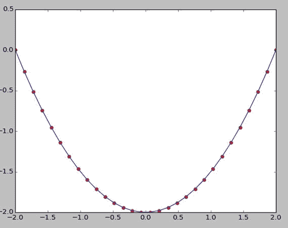
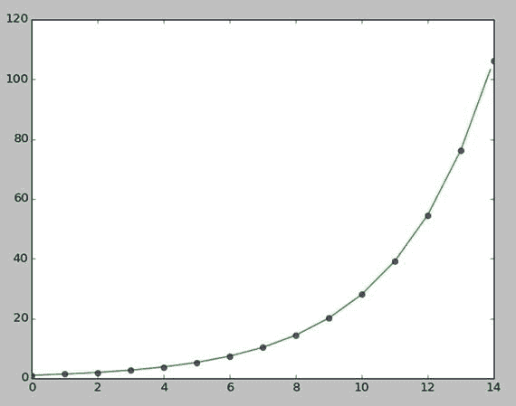
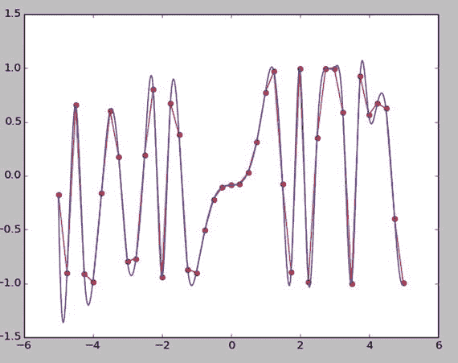
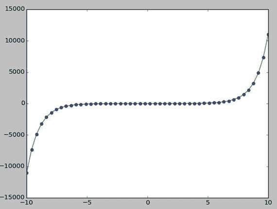
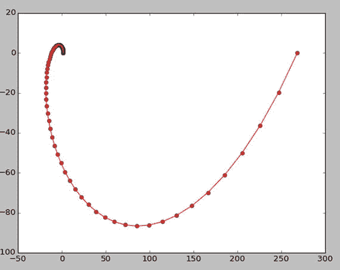

# 11.SciPy 简介

在上一章中，我们学习了如何使用 NumPy 进行数值计算。我们还学习了如何方便地使用 Jupyter，以及如何使用 matplotlib 进行可视化。在本章中，我们将介绍 SciPy 库。然而，我们与 NumPy 和 matplotlib 的旅程还远未结束。在本书的剩余部分，我们将学习 NumPy 和 matplotlib 的新功能。因此，让我们和 SciPy 一起踏上科学计算的激动人心的旅程。

## SciPy 中的科学和数学常数

在我们开始之前，让我们完成为本章创建一个新目录的仪式。请为本章创建一个目录`chapter` `11`。

```py
cd ∼
cd book
cd code
mkdir chapter11
cd chapter11

```

现在，使用以下命令启动 Jupyter 笔记本应用程序:

```py
jupyter notebook

```

打开一个新笔记本，重命名为`Chapter11_Practice`。这个笔记本将保存本章的代码。

SciPy 库有一个名为`scipy.constants`的模块，其中有许多重要的数学和科学常数的值。让我们试几个。在笔记本中运行以下代码:

```py
import numpy as np
import matplotlib.pyplot as plt
from scipy.constants import *
print("Pi = " + str(pi))
print("The golden ratio = " + str(golden))
print("The speed of light = " + str(c))
print("The Planck constant = " + str(h))
print("The standard acceleration of gravity = " + str(g))
print("The Universal constant of gravity = " + str(G))

```

输出如下所示:

```py
Pi = 3.141592653589793
The golden ratio = 1.618033988749895
The speed of light = 299792458.0
The Planck constant = 6.62606957e-34,
The standard acceleration of gravity = 9.80665
The Universal constant of gravity = 6.67384e-11

```

请注意，SciPy 常量不包括度量单位，仅包括常量的数值。这些在数值计算中非常有用。

Note

还有更多这样的常数。请访问 [`https://docs.scipy.org/doc/scipy/reference/constants.html`](https://docs.scipy.org/doc/scipy/reference/constants.html) 查看更多。

## 线性代数

现在我们将学习几个与线性代数相关的方法。让我们从矩阵的逆矩阵开始:

```py
import numpy as np
from scipy import linalg
a = np.array([[1, 4], [9, 16]])
b = linalg.inv(a)
print(b)

```

以下是输出:

```py
[[-0.8   0.2 ]
 [ 0.45 -0.05]]

```

我们也可以求解矩阵方程`ax = b`如下:

```py
a = np.array([[3, 2, 0], [1, -1, 0], [0, 5, 1]])
b = np.array([2, 4, -1])
from scipy import linalg
x = linalg.solve(a, b)
print(x)
print(np.dot(a, x))

```

以下是输出:

```py
[ 2\. -2\.  9.]
[ 2\.  4\. -1.]

```

我们可以如下计算矩阵的行列式:

```py
a = np.array([[0, 1, 2], [3, 4, 5], [6, 7, 8]])
print(linalg.det(a))

```

在笔记本中运行上面的代码，自己看看结果。

我们还可以计算矩阵的范数，如下所示:

```py
a = np.arange(16).reshape((4, 4))
print(linalg.norm(a))
print(linalg.norm(a, np.inf))
print(linalg.norm(a, 1))
print(linalg.norm(a, -1))

```

以下是结果:

```py
35.2136337233
54
36
24

```

我们也可以计算 QR 和 RQ 分解如下:

```py
from numpy import random
from scipy import linalg
a = random.randn(3, 3)
q, r = linalg.qr(a)
print(a)
print(q)
print(r)
r, q = linalg.rq(a)
print(r)
print(q)

```

## 综合

SciPy 有用于各种集成操作的`integrate`模块，所以让我们看看它的一些方法。第一个是`quad()`。它接受要积分的函数以及积分的极限作为参数，然后返回数值和近似误差。以下是几个例子:

```py
from scipy import integrate
f1 = lambda x: x**4
print(integrate.quad(f1, 0, 3))
import numpy as np
f2 = lambda x: np.exp(-x)
print(integrate.quad(f2, 0, np.inf))

```

以下是输出结果:

```py
(48.599999999999994, 5.39568389967826e-13)
(1.0000000000000002, 5.842606742906004e-11)

```

`trapz()`使用梯形法则沿给定轴积分:

```py
print(integrate.trapz([1, 2, 3, 4, 5]))

```

以下是输出:

```py
12.0

```

让我们看一个使用梯形法则的累积积分的例子。

```py
import matplotlib.pyplot as plt
x = np.linspace(-2, 2, num=30)
y = x
y_int = integrate.cumtrapz(y, x, initial=0)
plt.plot(x, y_int, 'ro', x, y[0] + 0.5 * x**2, 'b-')
plt.show()

```

以下(图 [11-1](#Fig1) )为输出:



图 11-1。

Cumulative integration using the trapezoidal rule

## 插入文字

这个模块有插值的方法。让我们借助 matplotlib 的图形表示来研究其中的一些。`interp1d()`用于一维插值，如下所示。

```py
from scipy import interpolate
x = np.arange(0, 15)
y = np.exp(x/3.0)
f = interpolate.interp1d(x, y)
xnew = np.arange(0, 14, 0.1)
ynew = f(xnew)
plt.plot(x, y, 'o', xnew, ynew, '-')
plt.show()

```

结果如下(图 [11-2](#Fig2) ):



图 11-2。

1-D interpolation

`interp1d()`适用于`y=f(x)`类型的功能。类似地，`interp2d()`处理`z=f(x, y)`类型的函数。它用于二维插值。

```py
x = np.arange(-5.01, 5.01, 0.25)
y = np.arange(-5.01, 5.01, 0.25)
xx, yy = np.meshgrid(x, y)
z = np.sin(xx**3 + yy**3)
f = interpolate.interp2d(x, y, z, kind='cubic')
xnew = np.arange(-5.01, 5.01, 1e-2)
ynew = np.arange(-5.01, 5.01, 1e-2)
znew = f(xnew, ynew)
plt.plot(x, z[0, :], 'ro-', xnew, znew[0, :], 'b-')
plt.show()

```

结果如下(图 [11-3](#Fig3) ):



图 11-3。

2-D interpolation

接下来，我们要学习`splev()`、`splprep()`和`splrep()`。`splev()`方法用于计算 B 样条或其导数。我们将把这种方法与用于表示 B 样条的`splprep()`和`splrep(),`一起使用。

`splrep()`用于表示一维曲线，如下所示:

```py
from scipy.interpolate import splev, splrep
x = np.linspace(-10, 10, 50)
y = np.sinh(x)
spl = splrep(x, y)
x2 = np.linspace(-10, 10, 50)
y2 = splev(x2, spl)
plt.plot(x, y, 'o', x2, y2)
plt.show()

```

结果如下(图 [11-4](#Fig4) ):



图 11-4。

Representation of a 1-D curve

`splprep()`用于表示一条 N 维曲线。

```py
from scipy.interpolate import splprep
theta = np.linspace(0, 2*np.pi, 80)
r = 0.5 + np.cosh(theta)
x = r * np.cos(theta)
y = r * np.sin(theta)
tck, u = splprep([x, y], s=0)
new_points = splev(u, tck)
plt.plot(x, y, 'ro')
plt.plot(new_points[0], new_points[1], 'r-')
plt.show()

```

下面(图 [11-5](#Fig5) )是结果。



图 11-5。

Representation of an N-D curve

## 结论

在本章中，我们介绍了 SciPy 库中几个重要且常用的模块。接下来的两章将着重向读者介绍信号和图像处理的专业科学领域。在下一章，我们将学习几个与信号处理相关的模块。