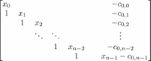
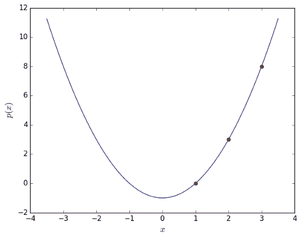
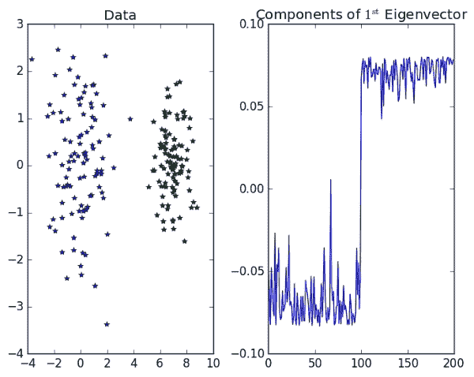
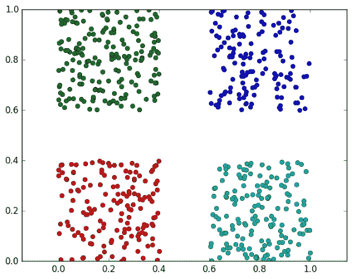

# 第十四章。综合示例

在这一章中，我们提出了一些全面和更长的例子，并简要介绍了理论背景和它们的完整实现。通过这一点，我们想向你展示如何在实践中使用本书中定义的概念。

# 多项式

首先，我们将通过设计一个多项式类来展示 Python 构造的强大功能。我们将给出一些理论背景，这将引导我们得到一个需求列表，然后我们将给出代码，并给出一些注释。

注意，这个类在概念上不同于类`numpy.poly1d`。

## 理论背景

一个多项式:*p*(*x*)*= a<sub>n</sub>x<sup>n</sup>+a<sub>n-1</sub>x<sup>n-1</sup>T13】+…+*a*T16】1T18】x+a*T20】0 由其度、其表示及其系数定义。上式所示的多项式表示称为单项表示。在该表示中，多项式被写成单项式的线性组合，*x<sup>I</sup>T25。或者，多项式可以写成:*

*   Newton representation with the coefficients *c<sub>i</sub>* and *n* points, *x<sub>0</sub>*, …, *x<sub>n-1</sub>*:

    *p*(*x*)*= c**+*【c】<sub xmlns:epub="http://www.idpf.org/2007/ops" xmlns:m="http://www.w3.org/1998/Math/MathML" xmlns:pls="http://www.w3.org/2005/01/pronunciation-lexicon" xmlns:ssml="http://www.w3.org/2001/10/synthesis">*x【x】-我...。+*c<sub>【n】t30</sub>*(*x<sub>0</sub>*)(*x<sub>n</sub><sub xmlns:epub="http://www.idpf.org/2007/ops" xmlns:m="http://www.w3.org/1998/Math/MathML" xmlns:pls="http://www.w3.org/2005/01/pronunciation-lexicon" xmlns:ssml="http://www.w3.org/2001/10/synthesis">-)</sub>**</sub>**

*   Lagrange representation with the coefficients *y<sub>i</sub>*and *n*+1 points, *x*<sub>0</sub>, … , *x<sub>n</sub>*:

    *p*(*x*)=*y*T6】0T8】lT10】0(*x*)+*y*T16】1T18】lT20】1(*x*)+……+*y<sub>n</sub>l<sub>n</sub>*

    具有基本功能:

    

有无限多种表现形式，但我们在这里仅限于这三种典型的表现形式。

多项式可以由插值条件确定:

*p*(*x<sub>I</sub>T5)=*y*T8】IT10】I*= 0，…， *n*

给定不同的值 *x <sub>i</sub>* 和任意值 *y <sub>i</sub>* 作为输入。在拉格朗日公式中，插值多项式是直接可用的，因为它的系数是插值数据。牛顿表示中的插值多项式的系数可以通过一个递归公式获得，称为除差公式:

*c <sub>i</sub>* <sub>，0</sub> = *y <sub>i、</sub>* 和

。

最后，设置。

单项表示中的插值多项式的系数是通过求解一个线性系统获得的:


以给定多项式 *p* (或其倍数)作为特征多项式的矩阵称为伴随矩阵。伴随矩阵的特征值是多项式的零点(根)。计算 *p* 零点的算法可以通过首先建立其伴随矩阵，然后用`eig`计算特征值来构造。牛顿表示的多项式的伴随矩阵如下:



## 任务

我们现在可以制定一些编程任务:

1.  用`points`、`degree`、`coeff`和`basis`属性写一个名为`PolyNomial`的类，其中:
    *   `points`是元组列表( *x <sub>i</sub> ，y<sub>I</sub>T6)*
    *   `degree`是对应插值多项式的次数
    *   `coeff`包含多项式系数
    *   `basis`是一个字符串，说明使用了哪种表示法
2.  为类提供一种在给定点计算多项式的方法。
3.  为该类提供一个名为`plot`的方法，在给定的时间间隔内绘制多项式。
4.  写一个名为`__add__`的方法，返回两个多项式之和的多项式。请注意，只有在单项情况下，总和才可以通过对系数求和来计算。
5.  写一个计算以单项形式表示的多项式系数的方法。
6.  写一个计算多项式伴随矩阵的方法。
7.  写一个通过计算伴随矩阵的特征值来计算多项式零点的方法。
8.  写一个计算多项式的方法，该多项式是给定多项式的第*I*<sup>次导数。</sup>
9.  写一个检查两个多项式是否相等的方法。可以通过比较所有系数来检查相等性(零前导系数应该无关紧要)。

# 多项式类

现在让我们基于多项式的单项公式设计一个多项式基类。多项式可以通过给出其关于单项式基的系数或给出插值点列表来初始化，如下所示:

```py
import scipy.linalg as sl

class PolyNomial:
    base='monomial'
    def __init__(self,**args):
        if 'points' in args:
            self.points = array(args['points'])
            self.xi = self.points[:,0]
            self.coeff = self.point_2_coeff()
            self.degree = len(self.coeff)-1
        elif 'coeff' in args:
            self.coeff = array(args['coeff'])
            self.degree = len(self.coeff)-1
            self.points = self.coeff_2_point()
        else:
            self.points = array([[0,0]])
            self.xi = array([1.])
            self.coeff = self.point_2_coeff()
            self.degree = 0
```

新类的`__init__`方法使用了[第 7 章](07.html "Chapter 7. Functions")、*函数*中*参数和参数*一节中讨论的`**args`构造。如果没有给定参数，则假设多项式为零。如果多项式由插值点给出，则通过求解范德蒙系统来计算系数的方法如下:

```py
def point_2_coeff(self):
    return sl.solve(vander(self.x),self.y)
```

如果给定了 *k* 系数，则 *k* 插值点通过以下方式构造:

```py
def coeff_2_point(self):
    points = [[x,self(x)] for x in linspace(0,1,self.degree+1)]
    return array(points)
```

`self(x)`命令进行多项式求值，这是通过提供一种方法`__call__`来完成的:

```py
def __call__(self,x):
    return polyval(self.coeff,x)
```

(参考第 8 章、*类[中*特殊方法*一节的例子。](08.html "Chapter 8. Classes")*)这里，该方法使用命令`polyval`。下一步，为了方便起见，我们只是增加了两种方法，我们用`property`装饰器来装饰(参见[第 7 章](07.html "Chapter 7. Functions")、*功能*中*作为装饰器的功能部分】 :*

```py
@property
def x(self):
    return self.points[:,0]
@property
def y(self):
    return self.points[:,1]
```

让我们解释一下这是怎么回事。我们定义了一种提取数据的 *x* 值的方法，用于定义多项式。类似地，定义了提取数据的 *y* 值的方法。使用`property`装饰器，调用方法的结果就好像它只是多项式的一个属性一样。有两种编码选择:

1.  We use a method call:

    ```py
          def x(self):
              return self.interppoints[:,0]
    ```

    这允许通过调用`p.x()`访问 *x* 值。

2.  我们使用`property`装饰机。它允许我们通过以下语句访问 *x* 值:`p.x`

我们选择第二种变体。定义一个`__repr__`方法(参考[第八章](08.html "Chapter 8. Classes")*类*中*属性*一节)总是一个好的做法。至少对于结果的快速检查，这种方法是有用的:

```py
def __repr__(self):
    txt  = 'Polynomial of degree {degree} \n'
    txt += 'with coefficients {coeff} \n in {base} basis.'
    return txt.format(coeff=self.coeff, degree=self.degree,
                                            base=self.base)
```

我们现在提供一种绘制多项式的方法，如下所示:

```py
margin = .05
plotres = 500
def plot(self,ab=None,plotinterp=True):
    if ab is None: # guess a and b
       x = self.x
       a, b = x.min(), x.max()
       h = b-a
       a -= self.margin*h
       b += self.margin*h
    else:
       a,b = ab
    x = linspace(a,b,self.plotres)
    y = vectorize(self.__call__)(x)
    plot(x,y)
    xlabel('$x$')
    ylabel('$p(x)$')
    if plotinterp:
        plot(self.x, self.y, 'ro')
```

注意`vectorize`命令的使用(参见[第 4 章](04.html "Chapter 4. Linear Algebra – Arrays")、*线性代数-数组*中*函数作用于数组*一节。`__call__`方法专用于单项表示，如果一个多项式用另一个基表示，则必须改变。多项式伴随矩阵的计算也是如此:

```py
def companion(self):
    companion = eye(self.degree, k=-1)
    companion[0,:] -= self.coeff[1:]/self.coeff[0]
    return companion
```

一旦伴随矩阵可用，多项式的零点由特征值给出:

```py
def zeros(self):
   companion = self.companion()
   return sl.eigvals(companion)
```

为此，功能`eigvals`必须首先从`scipy.linalg`导入。我们来举一些用法的例子。

首先，我们从给定的插值点创建一个多项式实例:

```py
p = PolyNomial(points=[(1,0),(2,3),(3,8)])
```

多项式关于单项式基的系数可作为`p`的属性获得:

```py
p.coeff # returns array([ 1., 0., -1.])
```

这对应于多项式。由`p.plot(-3.5,3.5)`得到的多项式默认图，结果如下图(*图 14.1* ):



图 14.1:多项式作图法的结果

最后，我们计算多项式的零点，在这种情况下是两个实数:

```py
pz = p.zeros() # returns array([-1.+0.j, 1.+0.j])
```

可以通过在以下几点评估多项式来验证结果:

```py
p(pz) # returns array([0.+0.j, 0.+0.j])
```

# 牛顿多项式

`NewtonPolyNomial`类定义了一个关于牛顿基描述的多项式。我们通过使用`super`命令(参见[第 8 章](08.html "Chapter 8. Classes")、*类*中的*子类化和继承*一节)，让它从多项式基类继承一些常见的方法，例如`polynomial.plot`、`polynomial.zeros`，甚至`__init__`方法的部分内容:

```py
class NewtonPolynomial(PolyNomial):
    base = 'Newton'
    def __init__(self,**args):
        if 'coeff' in args:
            try:
                self.xi = array(args['xi'])
            except KeyError: 
                raise ValueError('Coefficients need to be given'
                'together with abscissae values xi')
        super(NewtonPolynomial, self).__init__(**args)
```

一旦给定插值点，系数的计算通过以下方式进行:

```py
def point_2_coeff(self):
    return array(list(self.divdiff()))
```

这里，我们使用除差来计算多项式的牛顿表示，它在这里被编程为生成器:

```py
def divdiff(self): 
    xi = self.xi
    row = self.y
    yield row[0]
    for level in range(1,len(xi)):
        row = (row[1:] - row[:-1])/(xi[level:] - xi[:-level])
        if allclose(row,0): # check: elements of row nearly zero
           self.degree = level-1
           break
        yield row[0]
```

让我们简单检查一下这是如何工作的:

```py
pts = array([[0.,0],[.5,1],[1.,0],[2,0.]]) # here we define the
  interpolation data: (x,y) pairs
pN = NewtonPolynomial(points=pts) # this creates an instance of the
  polynomial class
pN.coeff # returns the coefficients array([ 0\. , 2\. , -4\. ,
  2.66666667])
print(pN)
```

`print`函数执行基类的`__repr__`方法并返回以下文本:

```py
Polynomial of degree 3
 with coefficients [ 0.     2.    -4.      2.66666667]
 in Newton basis.
```

多项式求值不同于基类的相应方法。`Newton.PolyNomial.__call__`方法需要覆盖`Polynomial.__call__`:

```py
def __call__(self,x):
    # first compute the sequence 1, (x-x_1), (x-x_1)(x-x_2),...
    nps = hstack([1., cumprod(x-self.xi[:self.degree])])
    return dot(self.coeff, nps)
```

最后，我们给出伴随矩阵的代码，它覆盖父类的相应方法，如下所示:

```py
def companion(self):
    degree = self.degree
    companion = eye(degree, k=-1)
    diagonal = identity(degree,dtype=bool)
    companion[diagonal] = self.x[:degree]
    companion[:,-1] -= self.coeff[:degree]/self.coeff[degree]
    return companion
```

注意布尔数组的使用。这些练习将进一步建立在这个基础上。

# 光谱聚类

特征向量的一个有趣的应用是对数据进行聚类。使用从距离矩阵导出的矩阵的特征向量，可以将未标记的数据分成组。谱聚类方法的名字来源于这个矩阵的谱的使用。 *n* 元素的距离矩阵(例如，数据点之间的成对距离)是 n × n 对称矩阵。给定这样一个 n × n 距离矩阵 *M* 和距离值*M<sub>ij</sub>T7】，我们可以如下创建数据点的拉普拉斯矩阵:*


这里，I 是单位矩阵， *D* 是包含 *M* 行和的对角矩阵，


数据聚类是从 *L* 的特征向量中获得的。在只有两类数据点的最简单情况下，第一个特征向量(即对应于最大特征值的特征向量)通常足以分离数据。

下面是一个简单的两类聚类的例子。下面的代码创建一些 2D 数据点，并基于拉普拉斯矩阵的第一特征向量对它们进行聚类:

```py
import scipy.linalg as sl

# create some data points
n = 100
x1 = 1.2 * random.randn(n, 2)
x2 = 0.8 * random.randn(n, 2) + tile([7, 0],(n, 1))
x = vstack((x1, x2))

# pairwise distance matrix
M = array([[ sqrt(sum((x[i] - x[j])**2)) 
                                  for i in range(2*n)]          
                                    for j in range(2 * n)])

# create the Laplacian matrix
D = diag(1 / sqrt( M.sum(axis = 0) ))
L = identity(2 * n) - dot(D, dot(M, D))

# compute eigenvectors of L
S, V = sl.eig(L)
# As L is symmetric the imaginary parts
# in the eigenvalues are only due to negligible numerical errors S=S.real
V=V.real
```

对应于最大特征值的特征向量给出了分组(例如，通过在 *0* 处设置阈值)，并且可以用以下公式表示:

```py
largest=abs(S).argmax()
plot(V[:,largest])
```

下图(*图 14.2* )显示了简单两类数据集的光谱聚类结果:



图 14.2:显示了简单的两类聚类的结果

对于更难的数据集和更多的类，通常取 *k* 最大特征值对应的 *k* 特征向量，然后用其他方法对数据进行聚类，但使用特征向量代替原始数据点。一个常见的选择是*k*-意味着聚类算法，这是下一个例子的主题:

特征向量用作 *k* 的输入-意味着聚类，如下所示:

```py
import scipy.linalg as sl
import scipy.cluster.vq as sc
# simple 4 class data
x = random.rand(1000,2)
ndx = ((x[:,0] < 0.4) | (x[:,0] > 0.6)) & 
                     ((x[:,1] < 0.4) | (x[:,1] > 0.6))
x = x[ndx]
n = x.shape[0]

# pairwise distance matrix
M = array([[ sqrt(sum((x[i]-x[j])**2)) for i in range(n) ]
                                       for j in range(n)])

# create the Laplacian matrix
D = diag(1 / sqrt( M.sum(axis=0) ))
L = identity(n) - dot(D, dot(M, D))

# compute eigenvectors of L
_,_,V = sl.svd(L)

k = 4
# take k first eigenvectors
eigv = V[:k,:].T

# k-means
centroids,dist = sc.kmeans(eigv,k)
clust_id = sc.vq(eigv,centroids)[0]
```

注意，我们在这里使用奇异值分解`sl.svd`计算特征向量。由于 *L* 是对称的，结果就像我们使用`sl.eig`一样，但是特征向量已经按照特征值的顺序排序了。我们还使用了一次性变量。`svd`返回一个包含三个数组的列表，左右奇异向量`U`、`V`，奇异值`S`，如下所示:

```py
U, S, V = sl.svd(L)
```

由于这里不需要`U`、`S`，所以在解`svd`的返回值时可以扔掉:

```py
_, _, V = sl.svd(L)
```

结果可通过以下方式绘制:

```py
for i in range(k):
    ndx = where(clust_id == i)[0]
    plot(x[ndx, 0], x[ndx, 1],'o')
axis('equal')
```

下图显示了简单*多类数据集的光谱聚类结果:*



图 14.3:简单四类数据集的光谱聚类示例。

# 求解初值问题

在这一节中，我们将考虑对给定初始值数值求解一个常微分方程组的数学任务:

*和* ( *t* ) *= f* ( *t，y* ) *和* ( *t* <sub xmlns:epub="http://www.idpf.org/2007/ops" xmlns:m="http://www.w3.org/1998/Math/MathML" xmlns:pls="http://www.w3.org/2005/01/pronunciation-lexicon" xmlns:ssml="http://www.w3.org/2001/10/synthesis">0】</sub>

这个问题的解决方案是一个函数 *y* 。一种数值方法旨在计算好的近似值，*y<sub>I</sub>T5】∑*y*(*t<sub>I</sub>*)在离散点，即通信点 *t <sub>i</sub>* ，在感兴趣的区间内[ *t <sub>0</sub> ，t* <sub xmlns:epub="http://www.idpf.org/2007/ops" xmlns:m="http://www.w3.org/1998/Math/MathML" xmlns:pls="http://www.w3.org/2005/01/pronunciation-lexicon" xmlns:ssml="http://www.w3.org/2001/10/synthesis">e</sub> 。我们在一个类中收集描述问题的数据，如下所示:*

```py
class IV_Problem:
    """
    Initial value problem (IVP) class
    """
    def __init__(self, rhs, y0, interval, name='IVP'):
        """
        rhs 'right hand side' function of the ordinary differential
                                                   equation f(t,y)
        y0 array with initial values
        interval start and end value of the interval of independent
        variables often initial and end time
        name descriptive name of the problem
        """
        self.rhs = rhs
        self.y0 = y0
        self.t0, self.tend = interval
        self.name = name
```

微分方程:


描述一个数学钟摆； *y <sub>1</sub>* 描述其相对于垂直轴的角度， *g* 为引力常数， *l* 为其长度。初始角度为π/2，初始角速度为零。

钟摆问题成为问题类的一个实例，如下所示:

```py
def rhs(t,y):
    g = 9.81
    l = 1.
    yprime = array([y[1], g / l * sin(y[0])])
    return yprime

pendulum = IV_Problem(rhs, array([pi / 2, 0.]), [0., 10.] ,
                                            'mathem. pendulum')
```

对于手头的问题可能会有不同的看法，从而导致不同的类设计。例如，人们可能希望将独立变量的间隔视为解决过程的一部分，而不是问题定义的一部分。考虑初始值时也是如此。正如我们在这里所做的，它们可能被认为是数学问题的一部分，而其他作者可能希望允许初始值的变化，将它们作为求解过程的一部分。

解决方案流程被建模为另一个类:

```py
class IVPsolver:
    """
    IVP solver class for explicit one-step discretization methods
    with constant step size
    """
    def __init__(self, problem, discretization, stepsize):
        self.problem = problem
        self.discretization = discretization
        self.stepsize = stepsize
    def one_stepper(self):
        yield self.problem.t0, self.problem.y0
        ys = self.problem.y0
        ts = self.problem.t0
        while ts <= self.problem.tend:
            ts, ys = self.discretization(self.problem.rhs, ts, ys,
                                                self.stepsize)
            yield ts, ys
    def solve(self):
        return list(self.one_stepper())
```

我们继续首先定义两种离散化方案:

*   显式**欧拉**法:

```py
      def expliciteuler(rhs, ts, ys, h):
          return ts + h, ys + h * rhs(ts, ys)
```

*   经典**龙格-库塔四阶段**法( **RK4** ):

```py
      def rungekutta4(rhs, ts, ys, h):
          k1 = h * rhs(ts, ys)
          k2 = h * rhs(ts + h/2., ys + k1/2.) 
          k3 = h * rhs(ts + h/2., ys + k2/2.)
          k4 = h * rhs(ts + h, ys +  k3)
          return ts + h, ys + (k1 + 2*k2 + 2*k3 + k4)/6.
```

有了这些，我们可以创建实例来获得摆式 ODE 的相应离散化版本:

```py
pendulum_Euler = IVPsolver(pendulum, expliciteuler, 0.001) 
pendulum_RK4 = IVPsolver(pendulum, rungekutta4, 0.001)
```

我们可以求解两个离散模型，并绘制解和角度差:

```py
sol_Euler = pendulum_Euler.solve()
sol_RK4 = pendulum_RK4.solve()
tEuler, yEuler = zip(*sol_Euler)
tRK4, yRK4 = zip(*sol_RK4)
subplot(1,2,1), plot(tEuler,yEuler),\
       title('Pendulum result with Explicit Euler'),\
       xlabel('Time'), ylabel('Angle and angular velocity')
subplot(1,2,2), plot(tRK4,abs(array(yRK4)-array(yEuler))),\
       title('Difference between both methods'),\
       xlabel('Time'), ylabel('Angle and angular velocity')
```


图 14.4:用显式欧拉方法模拟摆，并与更精确的龙格-库塔 4 方法的结果进行比较

讨论替代的班级设计是值得的。什么应该放在单独的班级里，什么应该捆绑到同一个班级里？

*   我们把数学问题和数值方法严格分开了。初始值应该放在哪里？他们应该是问题的一部分还是解决者的一部分？还是应该将它们作为求解器实例的求解方法的输入参数？人们甚至可以设计程序，使其允许多种可能性。使用其中一种替代品的决定取决于该程序的未来用途。通过将初始值作为求解方法的输入参数，可以简化参数识别中对各种初始值的循环。另一方面，用相同的初始值模拟不同的模型变量会促使将初始值与问题联系起来。
*   为了简单起见，我们只介绍了具有恒定给定步长的解算器。`IVPsolver`类的设计是否适合自适应方法的未来扩展，在这种扩展中给出的是公差而不是步长？
*   我们之前建议使用发电机结构作为步进机构。适应性方法需要不时地拒绝步骤。这种需求是否与`IVPsolver.onestepper`中步进机构的设计相冲突？
*   我们鼓励您检查用于求解初始值的两个 SciPy 工具的设计，即`scipy.integrate.ode`和`scipy.integrate.odeint`。

# 总结

我们在这本书里解释的大部分内容被捆绑到本章的三个较长的例子中。它们模仿代码开发并给出原型，鼓励你改变和面对自己的想法。

您看到科学计算中的代码可以有自己的味道，因为它与数学定义的算法有很强的关系，并且保持代码和公式之间的关系可见通常是明智的。正如您所看到的，Python 在这方面有技巧。

# 练习

**Ex。1** →实现一种方法`__add__`，通过将两个给定的多项式 *p* 和 *q* 相加，构造一个新的多项式 *p+q* 。在单项式中，多项式只需将系数相加即可，而在牛顿式中，系数取决于插值点的横坐标 *x <sub>i</sub>* 。在将两个多项式的系数相加之前，多项式 *q* 必须获得新的插值点，其横坐标 *x <sub>i</sub>* 与 *p* 的横坐标一致，并且必须为此提供方法`__changepoints__`。它应该改变插值点并返回一组新的系数。

**Ex。2** →编写转换方法，将一个多项式从牛顿形式转换为单项式形式，反之亦然。

**Ex。3** →编写一个名为`add_point`的方法，该方法将一个多项式 *q* 和一个元组 *(x，y)* 作为参数，并返回一个新的插值`self.points`和 *(x，y)* 的多项式。

**Ex。4** →编写一个名为`LagrangePolynomial`的类，以拉格朗日形式实现多项式，并尽可能从多项式基类继承。

**Ex。5** →为多项式类编写测试。