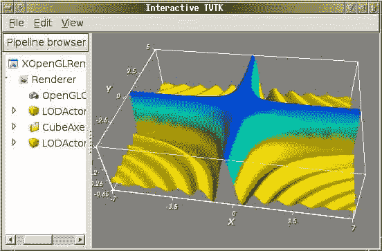
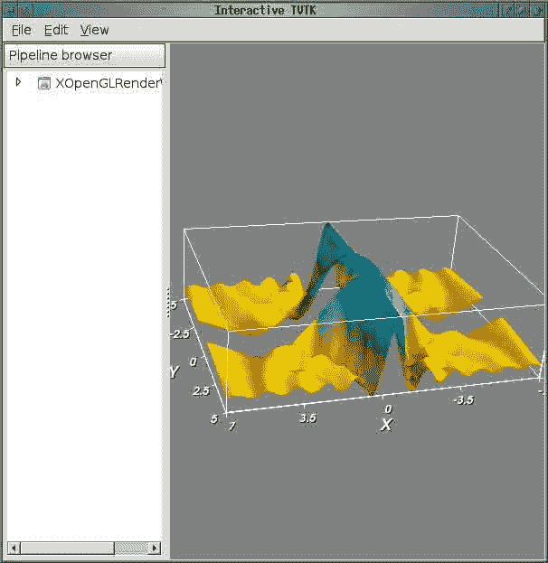
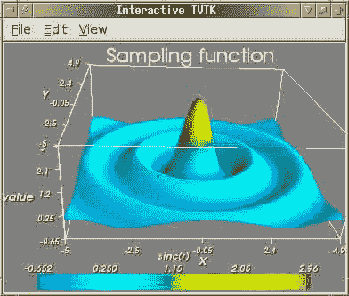

# Mayavi / TVTK

# Mayavi / TVTK

*   [【may ABI:mlab】](MayaVi_mlab.html)
*   [Mayavi tvtk](MayaVi_tvtk.html)
*   [什么是 tvtk？](MayaVi_tvtk.html#what-is-tvtk)

# 玛比:姆拉迪

# 玛比:姆拉迪

|| 本页是关于 tvtk.tools.mlab 模块的。强烈建议您使用更新的 [mayavi.mlab 模块](http://enthought.github.com/mayavi/mayavi/mlab.html)，该模块也可以从 *ipython -wthread* 中使用，或者作为另一个应用程序中的库使用。||

`mlab.py`模块允许简单的物体三维绘图。它为三维可视化提供了一种面向对象的方法。

它依赖于简单的 TVTK 模块，而不是成熟的 Mayavi 应用程序。因此，它具有较少的依赖性。然而，它更难扩展，也更受限制。开发人员不打算在该模块中添加任何功能，我们强烈建议您使用 Mayavi mlab 模块，该模块提供相同的用例，但功能更多，并且正在不断开发中。更多信息可以阅读[美亚威用户指南](http://enthought.github.com/mayavi/mayavi/mlab.html)相关章节

''目录'''

## 一个简单的例子

|| **重要提示:**所有这些示例都必须在“ipython -wthread”或 Wx 应用程序(如 py 地壳或 Mayavi2 应用程序)中运行。如果不使用此选项，它们**将不起作用**。||

从`ipython -wthread`开始，粘贴如下代码:

```py
.. code:: python 
```

> 导入 scipy
> 
> # 准备一些有趣的函数:def f(x，y):
> 
> >返回 3.0*scipy . sin(x*y+1e-4)/(x * y+1e-4)
> 
> x = scipy . arang(-7.7 . 05 . 0 . 1)y = scipy . arang(-5.5 . 05 . 0 . 1)
> 
> # f 的 3D 可视化:来自 entsure . tvtk . tools import mlab fig = mlab . fig()s = mlab。表面规则(x，y，f)图添加

[](文件/附件/Mayavi _ mlab/simple _ example . png

## 改变轴和颜色

```py
from scipy import *

[x,y]=mgrid[-5:5:0.1,-5:5:0.1]
r=sqrt(x**2+y**2)
z=sin(3*r)/(r)

from enthought.tvtk.tools import mlab

# Open a viewer without the object browser:
f=mlab.figure(browser=False)

s=mlab.Surf(x,y,z,z)
f.add(s)
s.scalar_bar.title='sinc(r)'
s.show_scalar_bar=True
# LUT means "Look-Up Table", it give the mapping between scalar value and color
s.lut_type='blue-red'
# The current figure has two objects, the outline object originaly present,
# and the surf object that we added.
f.objects[0].axis.z_label='value'
t=mlab.Title()
t.text='Sampling function'
f.add(t)
# Edit the title properties with the GUI:
t.edit_traits() 
```

[](文件/附件/MaYavi _ mlab/tvtk . mlab _ example . png

## 不同功能的列表

这里提供的实现是面向对象的，每个可视化功能都被实现为一个具有特性的类。所以这些都可以配置。每个可视化类(最终)从 MLabBase 派生，MLabBase 负责在渲染窗口中添加/移除其参与者。这些类都要求渲染窗口是一个`pyface.tvtk.scene.Scene`实例(如果以后有必要，这个约束可以放宽)。

本模块提供以下广泛的功能:

`*` **`Figure`** `This basically manages all of the objects rendered. Just like`` figure in any Matlab like environment. A convenience function`` called`【图】`may be used to create a nice Figure instance.``*`**`This and its subclasses let one place glyphs at points specified`` as inputs. The subclasses are:`【箭】`,`【锥】`,`【立方】`, ```py 气缸`,`**

 **要查看所有这些的好例子，请看这个文件末尾的`test_*`函数。下面是一个使用这些测试函数的快速示例:

```
from enthought.tvtk.tools import mlab
f = mlab.figure()
mlab.test_surf(f) # Create a spherical harmonic.
f.pop() # Remove it.
mlab.test_molecule(f) # Show a caffeine molecule.
f.renwin.reset_zoom() # Scale the view.
f.pop() # Remove this.
mlab.test_lines(f) # Show pretty lines.
f.clear() # Remove all the stuff on screen. 
```

## 附件

*   [`simple_example.png`](../_downloads/simple_example.jpg)
*   [`simpleexample.png`](../_downloads/simpleexample.jpg)
*   [`tvtk.mlab_example.png`](../_downloads/tvtk.mlab_example.jpg)

  

# 玛雅瓦 tvtk

# 玛雅瓦 tvtk

|| 此页面不是文档的主要来源。请参考 [Mayavi2 主页](http://enthought.github.com/mayavi/mayavi)了解 TVTK 的最新文档。特别要记住的是，如果你正在寻找一个高级别的 Python 3D 绘图库，Mayavi 也提供了合适的 API，并且可以嵌入(参见[用户指南](http://enthought.github.com/mayavi/mayavi/building_applications.html))。||**